# Aurora 平台完整阶段交付计划

> 状态：已接受（Accepted） 
> 版本：1.1 
> 日期：2026-09-14 
> 顺序：Runtime → Local HMI → Gateway/Remote HMI → Studio/IDE → Plugin Ecosystem

## 1. 使用方式

本文档将架构决策转换为可验收的交付阶段。阶段编号表示依赖与验收顺序，不代表固定日历周期；在团队规模、硬件型号和供应链确定前不承诺日期。

每个阶段只有在退出门槛全部通过后才进入下一产品门槛。允许并行开发，但不得绕过依赖契约、故障注入和兼容性测试。

```mermaid
flowchart LR
    F0[Phase F0<br/>契约与工程底座]
    R0[Phase R0<br/>控制执行内核]
    R1[Phase R1<br/>Aurora ST]
    R2[Phase R2<br/>Cyclic Workflow]
    R3[Phase R3<br/>Guardian & I/O]
    R4[Phase R4<br/>Package & Target]
    R5[Phase R5<br/>Data & Hosted]
    H0[Phase H0<br/>Local HMI]
    G0[Phase G0<br/>Gateway & Remote]
    I0[Phase I0<br/>Studio / IDE]
    E0[Phase E0<br/>Plugin Ecosystem]

    F0 --> R0 --> R1 --> R2 --> R3 --> R4 --> R5 --> H0 --> G0 --> I0 --> E0
```

## 2. 全阶段共同门槛

以下要求不是最后补做，而是从首次提交开始持续执行：

- Linux x64、Rust `std` 和固定工具链是 Runtime 唯一首版基线。
- 生产代码、契约和生成器必须有自动测试；关键状态机必须包含故障与断电注入。
- 构建、验证、审批和生产签名分离；发布携带来源证明、SBOM 和测试证据。
- 周期路径禁止数据库、网络、文件、阻塞日志、无界队列和运行期插件发现。
- 所有跨进程和持久化格式具有版本、兼容范围与迁移测试。
- 机器可读的 Schema 字段、标识、诊断/Trace code、排序、序列化和 Hash 必须与 host locale
  无关；可本地化内容只能通过稳定资源键和有类型参数在非周期边界渲染，不得改变控制语义。
- 每阶段更新威胁模型、权限矩阵、资源预算和运维手册。
- 功能安全始终由独立安全系统承担；Aurora Fallback 不宣称为安全功能。

## 3. Phase F0：契约、仓库与质量底座

### 目标

冻结所有后续阶段共同依赖的类型、版本和测试骨架。

### 交付物

- Rust workspace、固定 toolchain、格式化、lint、单元测试和交叉构建基线。
- `aurora-types`、错误码、质量码、时间、ID、版本和 capability 基础类型。
- Protobuf、Control Shared Layout、JSON Schema、WIT 的目录和版本规则。
- Canonical IR、Target Profile、Payload/Envelope 清单的首个 Schema。
- 仿真时钟、虚拟 I/O、故障注入和确定性回放测试框架。
- 安全开发流程、威胁模型模板、SBOM 和构建来源流水线。
- 架构 ADR、兼容策略、代码所有权和发布审批规则。

### 退出门槛

- 干净环境可以复现基础构建并产生相同 Schema/生成代码摘要。
- Rust/C# 生成契约通过双向兼容测试。
- CI 能执行 Linux x64 测试、静态分析、依赖扫描和产物归档。
- 架构问题清单关闭，接口层未决项已转为带负责人和验收条件的规格任务。

### 本阶段不包含

- 可运行控制程序、真实设备驱动、生产部署和 UI。

## 4. Phase R0：Control Engine 执行内核

### 前置条件

Phase F0 通过。

### 交付物

- 单调时钟、绝对周期调度、多周期任务、相位、优先级和 deadline。
- 固定容量容器、预分配工作集、周期诊断与无阻塞 SPSC。
- 单写者/多读者跨任务双缓冲，版本、时间、质量和 `Stale` 语义。
- 周期状态/输出原子提交、任务 Fault 锁定、重新初始化和 Fallback 请求。
- `HardLimit`、miss 窗口、连续 miss、Degraded/Fault 状态机。
- Observe 级别的任务、变量和时序 Trace 格式。

### 退出门槛

- 相同输入 Trace 产生逐周期相同状态、输出和诊断。
- 并发压力下不存在跨任务撕裂读取、多写者或周期线程锁等待。
- Fault 周期不提交部分输出，半更新私有状态不能继续执行并在复位时丢弃，复位后从声明初值启动。
- 输出实际周期、p50/p99.9/max 抖动、deadline miss、CPU 和队列水位报告。

### 本阶段不包含

- Aurora ST、工作流、真实 I/O、数据库和网络服务。

## 5. Phase R1：Aurora ST 编译链

### 前置条件

Phase R0 的任务和 Fault 契约稳定。

### 交付物

- 版本化语法、Lexer/Parser、AST、名称解析、类型检查和诊断。
- 固定宽度整数、REAL/LREAL、定长字符串/数组/结构和静态 Function Block。
- checked/saturating/wrapping 整数运算、除零/浮点异常、边界与容量检查。
- `%I/%Q/%M` 语法以及 Device Mapping 绑定和重叠检查。
- AST → Canonical IR → Linux x64 AOT，完整 Source Map。
- 参考解释器或仿真执行器，用于与 AOT 结果差分测试。
- CLI：format、check、build、test、IR dump 和 source-map 查询。

### 退出门槛

- 语言一致性测试覆盖正常、边界、Fault 和初始化语义。
- 参考执行器与 AOT 对同一测试向量逐周期一致。
- 编译器拒绝无界循环、动态周期内存、多写输出和非法地址映射。
- Target 不安装编译器即可加载并运行签名后的 AOT 产物。

### 本阶段不包含

- 图形 ST 编辑器、Online Change、RETAIN/PERSISTENT 跨版本迁移。

## 6. Phase R2：Cyclic Workflow 与时序模型

### 前置条件

Phase R1 的 Canonical IR、POU 调用和 Source Map 稳定。

### 交付物

- Workflow Graph Schema、验证器、编译器和静态执行计划。
- 每节点每周期一次、周期末状态提交、跨周期回边语义。
- Fork、Join All/Any、取消策略、子工作流、超时和最大次数。
- Workflow 调用 ST POU、设备动作与有类型命令的契约。
- 工作流画布数据模型和 PLC 扫描时序 Trace：活动节点、转移、I/O、FB 状态、Fault、Force、Fallback。
- CLI/测试查看器支持离线仿真和 Trace 回放；完整 Studio 编辑器后置。
- Workflow Graph、诊断和 Trace 只承载 locale-neutral 的稳定 code、标识和有类型参数；编译、
  排序、容量计算与产物 Hash 不读取系统语言、区域数字或日期格式。

### 退出门槛

- 图拓扑、写入冲突、循环上限和最坏周期资源可以静态检查。
- 同一输入 Trace 的活动节点、转移和输出完全可复现。
- 并行分支不创建运行线程，Join/取消和分支 Fault 测试通过。
- 时序 Trace 能解释每次输出变化来自哪个节点、POU 和扫描周期。
- 同一工程在不同 host locale 下生成相同验证结果、静态计划、Trace 语义和生成文件摘要。

### 本阶段不包含

- 传统 LD 触点/线圈编辑器、Hosted Workflow、完整 Studio UI。
- 五国语言资源包、语言切换、翻译文本、字体回退和本地化布局；这些能力在 H0/I0 冻结并实现。

## 7. Phase R3：I/O Guardian、驱动与设备闭环

### 前置条件

Phase R0-R2 的 I/O 映像和任务边界稳定。

### 交付物

- 槽外 Guardian、N/N-1 Guardian Contract、Epoch、租约和共享内存双缓冲。
- I/O Update Group、总线周期/相位、输入采样和输出窗口同步。
- Fallback active/pending 配置、输出保护等级和设备 watchdog 模拟器。
- 第一方低延迟静态驱动，以及 Guardian 管理的隔离 Driver Host 骨架。
- EtherCAT MainDevice 使用统一 Driver Adapter；系统可安装 EtherCrab 首选后端和获批 IgH 替代后端，
  每个 NIC 单 owner，切换必经 Fallback、资源释放、候选健康窗口和新 epoch/lease，禁止自动热切换。
- 第一方 Modbus TCP Client、RS-485/RS-232 + Modbus RTU Master、SocketCAN CAN 2.0/CAN FD 和
  获批硬件上的 LIN controller；全部使用固定角色、帧、容量、timeout 和恢复语义。
- Studio/CLI/CI 共用的 ESI/DBC/LDF importer、严格声明式 Device Description 与 normalized mapping
  builder 契约；R3 先以 CLI/测试入口验证，Runtime 不解析原始设备描述。
- 设备断连、乱序、过期输出、Guardian/Control 崩溃和恢复状态机。
- 项目级 Target Profile 性能预算、采集/故障注入和报告工具；正式长稳与整机调优在 I0-08 完成。

### 剩余工作项与门禁顺序

| 工作项 | 门禁 | 完成条件 |
| --- | --- | --- |
| R3-01 | Contract Gate | 双向 N/N-1、epoch/lease、新映射、独立 heartbeat/freshness、capability 和不可变配置由显式类型与测试固定 |
| R3-02 | Image ABI Gate | region/slot 黄金字节、原子发布、撕裂/争用/崩溃、容量和质量语义通过 |
| R3-03 | Scheduling Gate | 所有 Update Group 具有固定周期/相位/窗口/工作量，慢组不会反压健康组或 Control Engine |
| R3-04 | Fallback Gate | FallbackDomain、类型化 action、active/pending、watchdog、危险输出恢复授权和故障注入通过 |
| R3-05 | Adapter Gate | 风险分级静态/隔离 Driver、每实例最小权限、backend-neutral Adapter 与仿真黄金 trace 通过 |
| R3-06 | EtherCAT Gate | EtherCrab 首选与 IgH 回退后端完成独立功能、短时预算、更新与单 owner 受控切换验证 |
| R3-07 | Modbus TCP Gate | 有界 Client、事务关联、过龄/重连/危险写拒绝和压力故障路径通过 |
| R3-08 | Serial/RTU Gate | 有界串行传输、RTU Master、稳定设备身份、半双工时序和拔插恢复通过 |
| R3-09 | CAN/LIN Gate | BUSMUST/TOSUN 上的 SocketCAN 与 BMAPI/libTSCAN LIN 条件能力、时序、bus-off/断连和内核矩阵通过 |
| R3-10 | Recovery Gate | 跨协议故障、进程终止、资源释放、重新独占、新租约和重复恢复通过 |
| R3-11 | Phase Gate | 报告 schema/采集/故障注入、短时目标硬件证据、供应链和最终验收可执行性关闭；不承担 8 小时长稳 |

R3-01～R3-04 先形成 Guardian 基础门禁，R3-05 关闭统一 Adapter 后，R3-06～R3-09 才能进入各协议
实现并可按独立设备矩阵并行。R3-10 依赖所有纳入协议，R3-11 是唯一阶段关闭点；任一门禁失败不得用
降级声明、平均值或另一 backend/设备的证据替代。

### 配置、部署与 Studio 边界

- R3 冻结并实现 `preferredBackend`、有序 `approvedFallbackBackends`、installed/approved capability、
  source digest 和切换授权语义；CLI、配置 Schema 与 Target Profile 是本阶段验证入口。
- R3-06 交付可由后续维护流程安装的 EtherCrab/IgH backend artifact 和安装/卸载前置条件，但不在普通
  Runtime `.aurpkg` 中安装槽外 backend。后端切换是签名配置变更和维护操作，不是周期故障自动热切换。
- 目标机可以并存多个获批 Driver Package；未选 backend 不启动、不加载模块且无设备权限。同一物理接口
  只有一个 owner，Runtime 不在线下载 driver/SDK，Target Agent 是安装验证与切换的唯一执行入口。
- Phase R4 的 Target Agent 与系统维护包负责槽外 backend 的签名验证、并存安装、更新、DKMS/MOK、
  staged rollback 和审计；应用部署只能选择已安装且被 Target Profile 批准的 backend。
- Phase I0 的 Studio 提供设备、Target Profile、首选/回退 backend 和受控切换策略编辑器；Studio 只生成
  与 CLI 相同的可审查工程配置，不能直接抢占 NIC、绕过 Target Agent 或向运行目标发送未签名切换。
- Studio 导入新 ESI/DBC/LDF、安装按 Vendor/DeviceId/Version/SHA-256 固定的声明式 Device Description，
  配置 Device Tree/mapping/schedule 后调用与 CLI/CI 相同 builder 并部署新 generation。新 LDF 通常不
  更新 firmware/driver；扫描只生成候选拓扑，不能“扫到就上线”。
- 其他现场驱动只有在多个实现满足同一 Adapter 契约且分别通过门禁时才复用首选/回退模型。稳定的
  Linux ABI（例如 SocketCAN）不为形式统一而制造第二 backend；仍禁止第三方动态驱动和运行期发现。

### 退出门槛

- Control Engine 无法直接打开物理设备；所有 I/O 经 Guardian 控制域。
- 强制终止 Control Engine 后在项目规定时间内进入并维持 Fallback。
- 强制终止 Guardian 后，支持 watchdog 的设备进入第二层预设输出。
- 输入年龄、输出延迟、总线抖动和 miss 的采集/报告链路可执行，并在目标硬件形成短时可审查证据。
- EtherCrab 与 IgH 在同一批准硬件、拓扑和工程上分别形成独立功能/短时预算证据；受控切换期间不存在
  双主、NIC 残留 owner、旧 lease 复用或危险输出自动恢复。
- 能力不足的设备/输出组合在激活前被拒绝。

### 本阶段不包含

- 第三方动态驱动、功能安全认证和跨平台 Runtime。
- OPC UA、MQTT/Sparkplug 网络服务、Modbus Server/RTU Slave、CANopen/J1939/DeviceNet、商业授权或
  强制产品认证现场栈；这些能力不能因底层 transport 存在而隐式获得支持。

## 8. Phase R4：Package、Target Agent 与安全部署

### 前置条件

Guardian/Control Contract 和 Target Profile 稳定。

### 交付物

- Deterministic Payload、Signed Envelope、来源证明、SBOM 和隔离签名服务接口。
- 槽外 Target Agent、应用 A/B、持久化激活日志、`active/pending/last_good` 和启动次数。
- Staged/Verified/FallbackArmed/PendingBoot/HealthChecking/Committed 状态机。
- 设备现场配对、唯一身份、mTLS、Secret Store、SecurityEpoch、防回退和吊销。
- 槽外防篡改审计 WAL、本地管理 CLI 和离线部署流程。
- 系统维护包、Guardian/Agent staged update 和 Recovery Launcher 原型。

### 退出门槛

- 在每个激活阶段断电均能回到 last_good 或受控 Recovery/Fallback。
- 上传中断、签名错误、目标不匹配、回退攻击和 Secret 缺失均在停止旧槽前拒绝。
- 新槽与旧槽均完成 Guardian Contract 和 Fallback 配置兼容验证。
- 开发签名包不能进入生产 Target；高风险操作先审计后执行。
- 两槽损坏时 Recovery Launcher 仍能提供受认证的恢复通道。

### 本阶段不包含

- Gateway、自动数据库 HA、Online Change 和远程云控制。

## 9. Phase R5：Data Bridge、Storage 与 Hosted 闭环

### 前置条件

Phase R4 提供稳定槽生命周期、身份和本地 IPC。

### 交付物

- Data Bridge：每消费者 Ring、完整快照 + 增量、Epoch、Schema Hash 和缺口恢复。
- Tag/Alarm/Trend/Diagnostics 契约；固定 Alarm 状态表、事件溢出和缺口可见性。
- Storage Service、PostgreSQL 单实例、可选 Redis、Schema Expand/Contract。
- WAL 归档、外部备份、恢复演练、分类保留、降采样、配额和离线缓存。
- Hosted Workflow：OperationId、事务 Outbox、幂等、补偿、人工确认和 fencing lease。
- 服务分级重启、资源 cgroup、限流、退避、熔断和 Degraded 状态。

### 退出门槛

- 任意消费者停止读取不会阻塞 Control Engine 或其他消费者。
- Bridge/Storage/PostgreSQL/Redis/Hosted 服务崩溃不停止健康控制任务。
- 数据缺口、Alarm 历史缺口、数据库离线和磁盘配额均明确显示并可恢复。
- 新 Schema 保持旧槽回滚兼容；不可逆 Contract 只能经维护审批执行。
- Hosted Workflow 在每个持久化边界崩溃后不会无控制地重复非幂等动作。

### 本阶段不包含

- 自动 PostgreSQL HA、远程 Gateway 和第三方 Hosted 插件。

## 10. Phase H0：Linux 本机 HMI

### 前置条件

Runtime R0-R5 全部门槛通过。

### 交付物

- Linux x64 Avalonia HMI Shell、签名 `.aurhmi`、角色、确认、审计和断线恢复。
- 本地认证 IPC 写命令和共享内存读通道。
- Tag、Alarm、Trend、Recipe、TimeQuality、Degraded 与历史缺口体验。
- 完整响应式布局引擎：自由画布、Grid/Stack/Dock/Flex/Wrap/Overlay、Anchor、断点和多尺寸预览。
- 无代码参数化 Symbol、页面模板、组合组件和内置工业控件。
- HMI Schema/Compiler、CLI 打包、Preview Host 与参考工程；图形设计器在 Phase I0 交付。
- HMI 独立 staged update/rollback 和 Runtime 双槽兼容校验。
- 版本化本地化资源包、BCP 47 locale 标识、默认语言、确定性 fallback、缺失键拒绝以及有类型
  占位符校验。首版目标为五个经批准 locale，具体集合与默认项在 SPEC-H0-001 冻结。

### 退出门槛

- 1080p 及以上目标分辨率、16:9/16:10/21:9 和 DPI 场景布局测试通过。
- HMI 卡死、崩溃、重启或 Ring 溢出不影响 Control Engine。
- 不兼容 Tag/命令/Capability 在安装前明确拒绝。
- Force、写值和高风险命令遵守租约、Fallback、审批和审计规则。
- 五个 locale 的资源键完整且占位符类型一致；不支持的 locale、缺失资源、CJK 字体和长文本
  扩展具有明确 fallback、告警和布局验证，语言切换不改变权限或命令语义。

### 本阶段不包含

- 第三方代码 Widget、远程 HMI、完整 Studio HMI 设计器和在线自动翻译服务。

## 11. Phase G0：Gateway 与远程 HMI

### 前置条件

本地 Runtime API 和 HMI 业务契约稳定。

### 交付物

- Gateway 的发现、mTLS、路由、连接复用、限流、审计汇聚和多目标操作。
- gRPC/HTTP2/TLS 工程、运行、调试和部署服务，支持续传和 capability 协商。
- Gateway 专属本地 SPSC 消费者，远程批处理、降采样和 Streaming。
- Windows/macOS 远程 HMI，共用 HMI 模型、业务契约、五 locale 资源包和 fallback 规则。
- Gateway 失联、证书轮换、网络分区和重连状态机。

### 退出门槛

- Gateway 失联不停止目标控制；重连不重复高风险命令。
- 多目标部署不能绕过每台 Target Agent 的本机验证。
- 远程慢消费者和网络拥塞不向周期线程传播背压。
- 证书失效时拒绝新远程控制，但保持当前 Runtime。
- 相同 locale 在 Linux 本机与 Windows/macOS 远程 HMI 上使用相同资源键、占位符和缺失键语义。

### 本阶段不包含

- QUIC、云端强依赖和完整设备管理 SaaS。

## 12. Phase I0：Windows Studio / IDE

### 前置条件

Runtime、HMI 和 Gateway 契约均通过独立 CLI/仿真验证。

### 交付物

- WinUI 3 工程外壳、文本工程树、Schema 编辑、构建、签名和部署体验。
- Aurora ST 编辑器：语法、语义、Source Map、在线监控和诊断。
- Cyclic Workflow 设计器与 PLC 扫描时序视图、Trace 回放和 Debug 边界控制。
- 完整响应式 HMI 设计器，通过独立 Avalonia Preview Host 呈现真实布局。
- 设备、I/O Update Group、Fallback、保护等级、Target Profile 和性能报告编辑器。
- Device Repository、ESI/DBC/LDF 导入、Device Tree、只产生候选配置的 commissioning 扫描，以及与
  CLI/CI 完全相同的 normalized mapping/LayoutDigest 构建入口。
- Observe/Commissioning/Debug 权限体验与审计可视化。
- Studio Shell 支持与 H0 一致的首版五 locale 集合，并编辑、校验和预览版本化 HMI 本地化资源；
  Studio 文案资源与工程语义、CLI 诊断 code 和构建产物保持分离。

### 退出门槛

- Studio 与 CLI 对同一工程生成完全相同的 IR、诊断和 Payload Hash。
- IDE 不保存任何只有 UI 自身能解释的隐藏语义。
- 编辑器崩溃不影响 Preview Host、Runtime 或已保存的文本工程。
- Workflow、ST、HMI 和设备映射均具备 Git 可审查的稳定格式。
- 在最终 Studio/部署/实际工程闭合后完成整机性能准入：baseline/tuned 各 3 次独立冷启动，每次不少于
  30 分钟且 100 万周期；tuned 配置至少 8 小时 soak；自动故障每项至少 100 次，人工硬件故障每项至少
  10 次。具体 pass/fail 仍取 Target Profile，不形成跨硬件或硬实时承诺。
- 仓库摘要以 SHA-256 链接原始 CI/构建制品；原始数据缺失或摘要不可验证时不得关闭最终门禁。
- 切换 Studio locale 不改变工程文件、诊断 code、生成 IR 或 Payload Hash；五 locale 的命令、
  高风险确认和错误占位符完整性测试通过。

### 本阶段不包含

- Online Change、传统 LD 编辑器和未经签名的进程内扩展。

## 13. Phase E0：插件生态与商业能力

### 前置条件

对应宿主契约至少经历一个稳定发布周期。

### 分阶段开放

1. **E0-A 声明式生态**：Device Package、无代码 Symbol/模板、签名、SBOM、SPDX、公开/私有仓库和离线导入。
2. **E0-B Hosted Wasm**：冻结首版 WIT，开放 Connector、转换和非周期业务逻辑；capability 默认拒绝并实施资源配额。
3. **E0-C HMI/IDE 扩展**：先开放声明式 Widget 和进程外 IDE Extension，再评估 Wasm 行为。
4. **E0-D 高信任扩展**：确有必要时开放签名且严格版本匹配的 Avalonia/WinUI 进程内程序集。
5. **E0-E 商业服务**：EntitlementProvider、离线授权、组织/设备组许可；Marketplace、支付和分成另行立项。

周期控制路径始终只允许构建期静态组合并通过预算审查的组件，不支持第三方运行期装卸。

### 退出门槛

- 未授权插件无法访问网络、文件、设备、Secret 或宿主 API。
- 插件崩溃、超限、升级和吊销均不会阻塞周期控制。
- 同一部署锁定唯一依赖解析结果并生成可审查 SBOM。
- 授权服务失效不突然停止正在运行的 Control Engine。

## 14. 发布列车与版本策略

- 每个阶段先发布 Engineering Preview，再进入 Target Pilot，最后成为 Stable Capability。
- Preview 契约允许破坏性调整，但必须带迁移工具；Stable 契约遵守明确废弃窗口。
- Guardian Contract 至少 N/N-1；HMI、Gateway、Studio 通过 capability 协商支持独立升级。
- 安全修复可以走紧急发布路径，但不能跳过 Payload 身份、签名、目标校验和审计。
- 每个 Stable 发布必须附升级、回滚、备份恢复、已知限制、支持周期和安全联系信息。

## 15. 最终产品完成定义

Aurora 首版平台完成需要同时满足：

- Runtime R0-R5、Local HMI、Gateway 和 Studio 的全部退出门槛。
- I0-08 在目标机器形成项目级性能准入报告，不将结果宣传为跨硬件保证；R3 仅负责工具、schema、短时
  正确性/硬件验证和最终测试可执行性。
- 应用 A/B、数据库迁移、HMI 更新和槽外维护分别具备可演练的恢复路径。
- 所有高风险操作可授权、可审计、可防重放，设备可安全配对、恢复和退役。
- 独立安全系统在 Aurora 全部组件失效时仍能完成安全动作。
- 插件生态可以后续演进，但其缺失不得阻挡核心 Runtime、HMI、Gateway 和 Studio 的首版发布。
