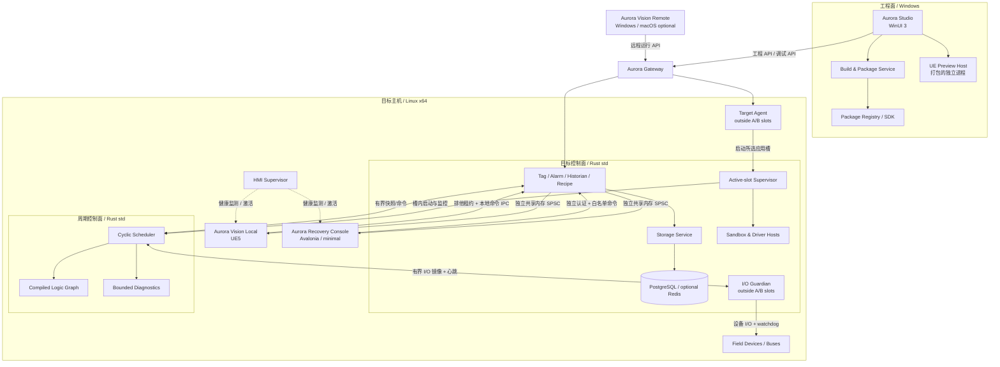
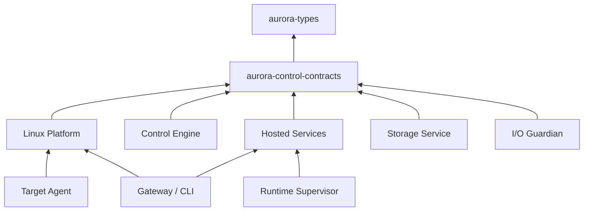

# Aurora 上位机平台总体架构方案

> 状态：已接受（Accepted）<br>
> 版本：1.2<br>
> 日期：2026-09-21<br>
> 范围：Rust 运行平台、Aurora Vision、Avalonia Recovery Console、WinUI 3 工程 IDE、插件与部署体系

## 1. 结论先行

Aurora 不应被设计为一个“大型桌面程序”，而应是由工程工具、HMI、网关、Hosted Services 和周期控制引擎组成的普通 Linux 平台。

Runtime 的已接受决策和实现边界以 [Aurora Runtime 架构方案](Aurora-Runtime-Architecture.md) 为准。
完整的依赖顺序、交付物和阶段退出门槛见 [Aurora 平台完整阶段交付计划](Aurora-Delivery-Roadmap.md)。

首版采用以下十三项基础决策：

1. **Rust 是平台核心，不是 UI 的附属 DLL。** 业务、设备接入、任务调度、变量、报警、历史和部署代理均由 Rust 承担；C# UI 只通过稳定契约访问核心。
2. **周期控制和 Hosted Services 逻辑隔离。** 两者都使用普通 Linux 和 Rust `std`，但周期控制线程不直接执行网络、磁盘或数据库操作；Hosted Services 通过有界通道交换快照和命令。
3. **Aurora Vision、Avalonia Recovery Console 与 WinUI 3 IDE 分成三个产品。** Aurora Vision 是正式产品名和完整生产 HMI，内部以 UE5 实现；首版与 Runtime 同机部署在 Linux，后续复用同一代码基线提供 Windows/macOS 远程客户端。`Aurora UE5 HMI` 只作为内部架构/实现名称，不进入产品标题、安装包显示名、界面或面向使用者的文档。Avalonia 只提供 UE 完全不可用时的最小状态与受控操作；IDE 仅面向 Windows。三者共享引擎中立的工程模型和协议，不共享 UI 控件程序集或引擎类型。
4. **插件按运行风险分轨。** Hosted 业务插件优先使用 WebAssembly Component + WIT；驱动插件使用隔离进程；进入周期控制路径的组件必须构建期静态组合并通过执行预算审查；只有受信任的 UI 扩展可以进程内加载。
5. **所有工程和部署结果文件化、可审查。** 源工程使用文本文件，依赖通过锁文件固定；部署包不可变、可签名、可回滚。
6. **借鉴 CODESYS 的分层，而不复制其实现。** 保留“工程系统—网关—运行时—设备描述—库/包仓库”的成熟边界，并增加跨平台 HMI、能力安全、进程隔离和现代 CI/CD。
7. **控制语言采用 ST + 工作流双模式。** ST 负责算法、运算和可复用 POU；Cyclic Workflow 是 LD 的可视化替代控制语言，采用确定的 PLC 扫描语义和时序展示，但不使用触点、线圈或梯级语法；Hosted Workflow 负责异步业务编排。
8. **首版采用非功能安全边界（路线 A）。** Aurora 负责普通控制、工程、监控和运行保护，但不承载经认证的功能安全功能；急停、人员防护和危险运动联锁必须由独立安全 PLC、安全继电器或硬件回路实现。
9. **更新期输出由槽外 I/O Guardian 维持。** Guardian 独立于应用 A/B 槽并拥有现场 I/O 排他访问权；Runtime 停止或心跳超时时由 Guardian 执行 `Fallback`，设备原生 watchdog 提供第二层保护。
10. **目标生命周期采用三层单一职责。** 槽外 Target Agent 独占安装、A/B 激活与回滚；每个应用槽内的 Supervisor 只管理本槽进程；Hosted Services 只承担业务能力，不参与部署状态机。
11. **首版性能只测量、不分级。** 不定义参考硬件、最低控制周期、最大容量或平台合格线；Runtime 提供完整观测数据，由具体项目在目标机器上自行验证。
12. **HMI 失效由外部监督并降级，不回退为第二套完整 HMI。** HMI Supervisor 在 UE 进程、渲染、数据或 GPU 失效时撤销 UE 命令租约并激活 Recovery Console；恢复 UE 控制需要连续健康窗口和操作员确认。两套界面均不进入周期控制或功能安全边界。
13. **Aurora Vision 采用 Royalty Product 分成模式。** 产品面向集团外公开销售或订阅，收入直接归属于软件访问或功能；仅从事该 Royalty Product 开发的 UE 使用不购买 Seat。发布前必须完成 Release Form，并按发布时适用的 Royalty Addendum 管理全球收入、排除项、报表和版税。开放源码仅限 Aurora 自有且许可证兼容的部分，不公开 Epic Licensed Technology。

## 2. 目标与边界

### 2.1 目标

- 支持设备配置、业务编排、调试、监控、部署、HMI 设计及运行。
- 支持 ST 程序与 Cyclic/Hosted Workflow 双层工作流，并允许工作流调用 ST POU、设备动作和子工作流。
- 首版 Aurora Vision 与 Runtime 同机部署在 Linux x64；后续以同一 UE Runtime 代码基线支持 Windows 和 macOS 远程客户端。
- UE/GPU/内容完全不可用时，独立 Avalonia Recovery Console 仍可显示关键状态并执行严格白名单内的受控操作。
- WinUI 3 IDE 提供 Windows 原生的复杂工程体验。
- Runtime 只支持普通 Linux x64 和 Rust `std`；默认允许 Control Engine、Storage Service、PostgreSQL 和可选 Redis 同机部署。
- 支持设备、协议、业务逻辑、HMI 控件、IDE 工具和诊断等扩展。
- 同一份工程生成模拟和普通 Linux 目标产物。
- 支持离线工程、现场局域网和远程运维三种使用方式。
- 支持通过获准商店、自有分发渠道和兼容的公开源码仓库向外部客户交付 Aurora Vision；二进制、源码和 Engine Tools 分别执行独立许可门禁。

### 2.2 首版非目标

- 不在第一阶段实现完整 IEC 61131-3 编程系统。
- 不支持或保留 RT-Linux、PREEMPT_RT、RTOS、裸机或 `no_std` 目标兼容边界。
- 不声明普通 Linux 周期控制具备硬实时能力。
- 不允许未经审查的动态插件进入周期控制路径。
- 不在 UE5、Avalonia 与 WinUI 之间建立控件级互操作，也不把引擎类型写入公开 HMI Schema。
- 不在运行期编译 Blueprint、C++ 或 Shader，不加载任意 Pak、脚本或未签名资产。
- 不实现传统 LD 触点、线圈和梯级编辑器；Cyclic Workflow 作为其替代并提供 PLC 扫描时序展示。
- 不把 Aurora Runtime、HMI、Gateway、ST 程序或工作流作为人员与设备功能安全保护的唯一实现。
- 不在首版声明或认证 SIL、PL 等功能安全等级。
- 不把免费内部用途、间接设备收入或其他 Royalty-Free Product 混入 Aurora Vision 的免 Seat 结论。
- 不在公开源码中包含 Epic Engine Code、Starter Content 源格式、受限资产或未获准的 Engine Tools，也不采用会迫使 Licensed Technology 受其他条款约束的不兼容许可证。

### 2.3 重要定义

- **工程面（Engineering Plane）**：项目编辑、编译、包管理、调试与部署。
- **操作面（Operation Plane）**：HMI、报警、趋势、配方和运维操作。
- **控制面（Control Plane）**：配置、生命周期、权限、命令和诊断。
- **周期控制面（Cyclic Control Plane）**：普通 Linux 上按周期执行的采样、运算、I/O 刷新和有界消息交换；不表示硬实时保证。
- **目标（Target）**：可部署 Aurora Runtime 的设备或系统。
- **组件（Component）**：平台内部具有明确接口和生命周期的模块。
- **插件（Plugin）**：由平台外部独立交付、具有清单和权限声明的扩展。
- **ST（Structured Text）**：用于算法、运算和可复用 POU 的文本控制语言前端。
- **Cyclic Workflow**：用于替代 LD 的可视化控制模型；与 ST 协同，按 PLC 扫描周期执行并提供梯形图式时序观察，但不采用触点/线圈语法。
- **Hosted Workflow**：用于网络、数据库、人工确认、重试、补偿和长流程持久化的异步业务编排模型。
- **独立安全系统（Independent Safety System）**：位于 Aurora 功能安全边界之外、负责急停、人员防护和危险运动联锁的安全 PLC、安全继电器或硬件回路。
- **运行保护状态（Operational Fallback）**：Aurora 普通控制系统在故障时采用的预定义降级输出或停止策略；它不构成功能安全保证，也不得替代独立安全系统。
- **Aurora Vision**：完整生产 HMI 的正式产品名；内部架构/实现名称为 `Aurora UE5 HMI`，后者不得作为用户可见品牌。
- **HMI 降级（HMI Degraded Mode）**：Aurora Vision 不可用时由 HMI Supervisor 激活 Recovery Console 的展示层降级；它不是设备生命周期的 `Recovery` 状态，也不自动触发 I/O `Fallback`。
- **Aurora Recovery Console**：不依赖 UE、Vulkan 或离散 GPU 的最小 Avalonia 客户端，只显示关键状态、诊断和允许的白名单命令；它不是完整 HMI。
- **HMI Supervisor**：独立于 Aurora Vision 和 Recovery Console 的本机监督进程，负责健康判定、界面激活和排他命令租约切换，不持有物理 I/O 或周期控制权。

## 3. 总体逻辑架构



默认目标拓扑将本机 Aurora Vision、Recovery Console、HMI Supervisor、Runtime、Hosted Services、Storage Service、PostgreSQL 和可选 Redis 部署在同一台普通 Linux 设备上。Aurora Vision 与 Recovery Console 分别通过自己的共享内存 SPSC 和认证本地 IPC 接入 Data Bridge/Command Broker，二者相互不依赖且写租约排他。Gateway 可以同机或远程部署，为 Studio 和后续远程 Aurora Vision 提供稳定契约。

## 4. 借鉴 CODESYS 的方式

| CODESYS 概念 | Aurora 对应设计 | Aurora 的调整 |
| --- | --- | --- |
| Development System | Aurora Studio | WinUI 3 外壳，后端能力通过协议和命令贡献 |
| Gateway | Aurora Gateway | 统一发现、认证、路由、在线调试和远程通道 |
| Runtime System | Aurora Runtime | 普通 Linux/Rust `std` 实现，周期控制与 Hosted Services 逻辑隔离 |
| Device Tree | Project/Target/Device Graph | 文本化节点、稳定 UUID、Schema 校验 |
| Device Description | `.aurdevice` 设备包 | 声明能力、参数、I/O、驱动和兼容范围 |
| Library Repository / Placeholder | Registry + SemVer + Lockfile | 显式依赖解析、内容哈希、可重现构建 |
| Package Manager | Aurora Package Manager | 签名、权限、信任级别、隔离策略和回滚 |
| Visualization | Aurora HMI | 独立 UE5 Runtime，Linux 本机与 Windows/macOS 远程共用中立 Schema |
| Degraded local operation | Aurora Recovery Console | 独立 Avalonia 最小客户端，不替代完整 HMI 或独立安全系统 |

CODESYS 官方资料表明，其运行时负责工程通信、应用装载执行、调试、I/O/现场总线及安全；设备描述定义设备能力与连接关系；库仓库、占位符和包管理器解决复用及版本适配。Aurora 保留这些职责边界，但采用文本工程、独立进程、现代接口定义和不可变部署包。

## 5. 产品与进程划分

### 5.1 Aurora Studio（WinUI 3）

Studio 是 Windows 专用工程 IDE，主要模块如下：

- Workspace：解决方案、项目、目标、设备和资源树。
- Editors：设备参数、ST、工作流、变量表、报警、配方、脚本和 HMI 页面编辑器。
- Build：依赖解析、Schema 校验、代码生成、Rust/插件构建和部署包生成。
- Online：发现、登录、下载、启动/停止、变量监控、强制值、跟踪和日志。
- Diagnostics：任务周期、抖动、最坏观测执行时间、周期预算、队列水位、设备健康度和故障快照。
- Extension Shell：命令、菜单、工具窗格、编辑器和构建步骤贡献点。

Studio 只持有编辑状态，不作为工程语义的唯一实现。校验、编译、迁移和打包能力必须可通过 CLI/Build Service 无界面运行，以支持 CI/CD。

### 5.2 Aurora Vision

Aurora Vision 是唯一完整生产操作界面，内部以 UE5 实现。首版作为 Linux 目标主机上的本机客户端交付，同一 UE Runtime 代码基线在 G0 提供 Windows/macOS 远程客户端：

- 加载签名的 `.aurhmi` 页面包和 `.aur3d` 三维资产包。
- 渲染二维页面、三维场景、模板、主题和本地化资源。
- 订阅 Tag、Alarm、Trend、Recipe 等运行 API，实施角色权限、操作确认、审计和离线/重连状态。
- 使用平台适配层处理窗口、通知、键盘、鼠标、触控和 GPU 能力差异。
- 支持自由画布与 Grid/Stack/Dock/Flex/Wrap/Overlay、Anchor、百分比尺寸、最小/最大尺寸、宽高比、断点和条件可见性，并面向不低于 1080p 的目标显示器验证。
- HMI Schema 保持引擎中立；构建期完成语义校验、资源预算、资产解析、Cooking、签名和兼容检查。
- 运行期仅从固定白名单实例化已烹饪的 UMG/Slate Widget、Actor、材质实例和行为；禁止运行期编译 Blueprint、C++ 或 Shader，禁止任意 Pak、脚本、未签名资产和运行期插件发现。

HMI 不直接加载 Studio 的 WinUI 控件。Studio 中的 HMI 设计器维护版本化的中立页面/场景模型；预览时启动打包的独立 UE Preview Host，通过 IPC 接收模型和模拟数据。Studio 和 Preview Host 均不分发 Unreal Editor、Editor module 或 Developer module。

### 5.3 Aurora Recovery Console 与 HMI Supervisor

Recovery Console 是 UE5 完全不可用时的最小 Avalonia 客户端，而不是第二套 HMI：

- 显示 Runtime、Guardian、Data Bridge、关键 Tag、当前 Alarm、数据质量/陈旧状态和 UE 故障原因。
- 只允许受控停止、普通控制 `Fallback` 请求、Alarm 确认和项目签名白名单中的少量命令。
- 禁止任意 Tag 写入、Force、配方下发、部署、调试、第三方 Widget、三维场景和功能安全承诺。
- 不依赖 UE、Vulkan 或离散 GPU，并保留认证本地 CLI/状态指示作为第三层入口。

HMI Supervisor 独立监测 UE 进程、窗口/渲染心跳、数据新鲜度和 GPU 状态。失败时先撤销 UE 写租约，再激活 Recovery Console；Recovery 必须重新认证、获取完整快照并校验 `ProducerEpoch`、`SchemaHash` 与连续序列后才可启用白名单命令。UE 恢复后必须经过连续健康窗口并由操作员确认，才允许排他租约切回，禁止自动抖动切换。

Aurora Vision、Recovery Console 和 HMI Supervisor 都不得直连物理 I/O、数据库、Redis、设备凭据或周期线程。它们只通过版本化 Data Bridge/Command Broker 契约工作，且均不属于功能安全系统。

本地化是展示层能力，不进入控制语义。Schema 字段、TagId、命令、权限、Fault、Trace code、
排序、序列化和 Hash 在所有 locale 下保持一致；Runtime 和周期线程不加载翻译资源。HMI 与
Studio 使用版本化资源键、BCP 47 locale 标识和有类型占位符，缺失键与不支持 locale 必须按
已冻结规则拒绝或回退，不得以翻译文本决定授权、确认或状态转移。首版目标为五个经批准 locale；
具体集合、默认 locale、fallback 链、字体和布局测试矩阵在 SPEC-H0-001 冻结，R2 只保证
locale-neutral 的 Workflow/Trace 契约，不交付语言包或切换 UI。

### 5.4 Aurora Gateway（Rust）

Gateway 是工程工具和目标运行时之间的稳定边界：

- 目标发现、路由和连接复用。
- mTLS 身份认证、授权和审计。
- 工程 API、运行 API、调试 API 的版本协商。
- 本地命名管道/Unix Domain Socket 与远程 gRPC/HTTP2/TLS 通道适配；首版不引入 QUIC。
- 限流、断线续传、部署包校验和多目标操作。

Gateway 不参与周期控制；网关断开不得导致周期控制任务停止。

### 5.5 Target Agent（Rust `std`，应用槽外）

- 唯一负责应用包签名验证、安装、A/B 槽选择、激活和回滚。
- 启动所选应用槽内与版本匹配的 Supervisor，并使用独立健康探针监督它。
- 编排 I/O Guardian 的 `Fallback` 预装和租约交接，但不直接管理 Control Engine 等槽内业务进程。
- Target Agent 采用独立维护流程更新，不包含在普通 `.aurpkg` 中。

### 5.6 Runtime Supervisor（Rust `std`，应用槽内）

- 启动、停止和监控本槽的 Control Engine、Data Bridge、Storage Service 与 Hosted Services。
- 在 Target Agent/systemd 已验证并创建的无特权 scope 内运行，只能使用签名清单获准的 CPU、内存、文件句柄和服务账户配置。
- 汇总本槽健康状态并报告 Target Agent，不执行安装、切槽、签名验证或回滚。
- 加载目标配置、周期控制组件和 Hosted 组件。
- 将周期计划和 I/O 镜像交给 Control Engine。
- 监控 Control Engine 心跳，但不持有周期控制线程所需的锁。

### 5.7 Control Engine（Rust `std`）

- 执行离线编译后的任务计划、ST 程序和 Cyclic Workflow 执行计划。
- 锁存 Guardian 输入镜像、执行逻辑、向 Guardian 原子提交内存输出镜像并采样诊断。
- 周期路径使用有界容器和非阻塞通信，不直接访问 PostgreSQL、Redis、网络或磁盘。
- 直接使用普通 Linux 的线程、单调时钟和共享内存，不保留实时 OS/RTOS 适配层。

### 5.8 I/O Guardian（Rust `std`）

- 独立于应用 A/B 槽常驻运行，排他持有现场设备与总线句柄。
- 与 Control Engine 交换带 epoch、序列号和租约的有界 I/O 镜像，拒绝过期或乱序输出。
- 在 Runtime 停止、崩溃、心跳超时和槽位切换期间执行并维持 `Fallback`。
- 持续驱动设备原生 watchdog；Guardian 自身失效时由设备应用第二层预设输出。
- 统一管理物理驱动：低延迟可信驱动静态组合，可能阻塞的驱动进入 Guardian 管理的隔离 Driver Host；Control Engine 不直接打开设备。
- Guardian Contract 独立版本化并至少支持 N/N-1；每个输出声明 Guardian、设备 watchdog 或外部安全保护等级，激活前校验。
- Guardian 与基础 OS 采用独立维护流程，不与普通应用 A/B 包同时升级；它不属于功能安全系统。

## 6. 普通 Linux Runtime 分层

### 6.1 依赖方向



所有 Runtime crate 使用 Rust `std`。模块边界服务于职责、调度和故障隔离，不承担 `no_std`、实时 OS、RTOS 或裸机移植目标。

| Crate | 用途 |
| --- | --- |
| `aurora-types` | ID、时间、质量码、错误码和共享类型 |
| `aurora-control-contracts` | Task、I/O、队列、诊断和服务契约 |
| `aurora-control-engine` | 周期调度、执行图、看门狗和快照 |
| `aurora-io-guardian` | 槽外 I/O 所有权、租约、`Fallback` 和设备 watchdog |
| `aurora-workflow-cyclic` | Cyclic Workflow 状态机 |
| `aurora-workflow-hosted` | Hosted Workflow 执行与恢复 |
| `aurora-services` | Tag、Alarm、Historian、Recipe |
| `aurora-storage-service` | PostgreSQL/Redis 访问、Schema 和持久化契约 |
| `aurora-gateway` | API、认证、路由和部署 |
| `aurora-target-agent` | 槽外安装、签名验证、A/B 激活与回滚 |
| `aurora-runtime-supervisor` | 槽内进程启动、资源限制与健康汇总 |
| `aurora-data-bridge` | Control Engine 与本机/远程消费者之间的有界数据桥 |
| `aurora-platform-linux` | 普通 Linux 线程、时钟、共享内存和设备适配 |

### 6.2 支持范围

| 范围 | 目标 | Rust 形态 | 定位 |
| --- | --- | --- | --- |
| Runtime | 普通 Linux x64 | `std` | 正式支持；周期控制属于软实时设计，不作硬实时保证 |
| Aurora Vision | 首版 Linux x64；后续远程 Windows/macOS | UE5 Runtime / C++ / UMG / Slate | 正式产品名；首版与 Runtime 同机，远程客户端经 Gateway 接入 |
| Recovery Console | Linux x64 | .NET/Avalonia | UE/GPU 不可用时的最小本机状态与白名单控制，不是完整 HMI |
| IDE | Windows | .NET/WinUI 3 + isolated UE Preview Host | 工程与调试工具；不分发 Unreal Editor |
| 实时 OS/Embedded | RT-Linux、PREEMPT_RT、RTOS、裸机 | 不适用 | 不支持且不保留兼容边界 |

默认部署允许 Control Engine、Hosted Services、Storage Service、PostgreSQL 和可选 Redis 位于同一台普通 Linux x64 设备上。通过线程优先级、CPU 配额、有界通道和资源监控降低数据库与 Hosted 负载对周期控制的影响，但不据此声明硬实时能力、最低性能或容量等级。

同机部署时，Control Engine、Storage Service 和 PostgreSQL 保持独立进程，由 systemd 与 cgroups v2 分别设置 CPU、内存和 I/O 配额。Storage Service 通过 Unix Domain Socket 和有界连接池访问 PostgreSQL；数据库迁移、备份、VACUUM 峰值和大查询必须限流或安排维护窗口。内存压力、WAL/checkpoint 或磁盘拥塞触发 Hosted 降级和告警，不能把背压传入周期控制线程。

### 6.3 周期控制规则

推荐周期模型：

1. 使用单调时钟等待绝对截止时间。
2. 锁存 I/O Guardian 发布的输入镜像、epoch 和序列号。
3. 按离线生成的拓扑和优先级执行任务。
4. 将输出镜像原子提交至 Guardian 共享内存槽；物理设备刷新由 Guardian 完成。
5. 将有界诊断样本推送给 Data Bridge。
6. 记录 deadline miss；超限时通知 Guardian 执行目标定义的降级或 `Fallback`，该策略不得替代独立功能安全系统。

周期控制路径禁止直接执行：

- PostgreSQL、Redis、文件、DNS、HTTP 和阻塞日志访问。
- 无界队列、不可界定循环和运行时插件发现。
- 等待 Hosted Services 持有的锁。
- 在周期线程中运行数据库迁移、Wasm 宿主或耗时异步任务。

Rust `std`、堆分配和 Tokio 可以用于初始化、Hosted Services 和非周期路径。周期路径应优先使用预分配缓冲、有界队列、SPSC、批量快照和可测量的执行预算。

首版不规定最低控制周期、最大抖动、允许的 deadline miss、最大任务/Tag/I/O 数量或 PostgreSQL 吞吐量。平台只报告实际周期、p50/p99.9/max 抖动、deadline miss、队列水位、CPU/内存/I/O 压力和数据库负载。项目可以设置自己的告警阈值与 `Fallback` 条件，但这些配置不构成 Aurora 的跨硬件性能承诺。

## 7. 通信与数据模型

### 7.1 三类通道

| 通道 | 场景 | 建议实现 | 约束 |
| --- | --- | --- | --- |
| Control API | 配置、生命周期、调试、包管理 | Protobuf + gRPC/HTTP2；远程 TLS/mTLS | 可版本化、可审计，不进入周期控制路径 |
| Local Data | 同机高频 Tag/趋势 | 每个消费者独立的共享内存 SPSC Ring + 控制 IPC | 固定槽位、周期控制写者永不阻塞 |
| Device Link | I/O Guardian 与现场设备 | 静态驱动或 Guardian 管理的隔离 Driver Host | 有界、序列号、时间戳、CRC、最大帧长；Control Engine 只访问 I/O 映像 |

远程周期数据应由 Gateway 使用自己的 SPSC Ring 获取快照，再进行批处理、降采样和 gRPC Streaming 转发，避免每个远程客户端直接给 Control Engine 施加负载。

SPSC Ring 满时按数据类型处理：Tag 覆盖旧快照，Trend 可降采样，低优先级诊断可丢弃并计数，Alarm/关键事件使用独立高优先级有界通道。所有数据携带序列号，任何丢失都不得静默隐藏。

### 7.2 契约管理

- `Contracts/proto/`：工程、运行、调试和部署 API。
- `Contracts/wit/`：沙箱插件接口。
- `Contracts/schema/`：工程、设备、HMI 和包清单 JSON Schema。
- `Contracts/control/`：周期控制共享布局及生成规则。
- 每个公开接口具有独立版本；破坏性升级使用新 package/service 名称。
- C# 与 Rust 客户端均由契约生成，不手工复制 DTO。
- 部署包记录 API、设备、插件和运行时的兼容范围及内容哈希。

### 7.3 Tag 语义

每个运行变量至少包含：

- 稳定 `TagId`，名称仅用于显示和路径解析。
- 数据类型、工程单位、读写属性和访问角色。
- Source Timestamp、Server Timestamp、单调序列及 `TimeQuality`；周期调度只使用单调时钟，UTC 只用于显示、审计和跨目标关联。
- Quality：`Good / Uncertain / Bad` 及细分原因。
- 可选的量程、死区、刷新率和历史策略。

命令写入必须带请求 ID、调用者、期望版本/时间戳和超时，避免断线重试造成重复动作。高风险的非安全控制操作应支持双确认或工作流审批；功能安全动作不得依赖 Aurora 命令链路完成。

## 8. 插件与组件模型

### 8.1 插件分类

| 类型 | 示例 | 执行位置 | 默认隔离 | 是否允许进入周期控制路径 |
| --- | --- | --- | --- | --- |
| Logic Component | 计算、转换、规则 | Wasm Host / Rust 服务 | Wasm capability sandbox | 否 |
| Connector | MES、MQTT、REST | 独立 Plugin Host | 进程 + capability | 否 |
| Device Driver | 相机、DAQ、总线 | I/O Guardian 或其管理的 Driver Host | 默认进程隔离；低延迟可信驱动可静态组合进 Guardian | 不直接进入 Control Engine |
| Control Component | PID、运动块、快速 I/O | Control Engine | 静态链接、构建期组合 | 是 |
| HMI Widget | 仪表、趋势、工艺控件、三维对象 | Aurora Vision | 首版固定白名单 + 已烹饪声明式资产；后续扩展另行评审 | 否 |
| IDE Extension | 编辑器、命令、工具窗格 | Studio/Extension Host | 默认进程外；受信任程序集可选 | 否 |
| Device Package | 参数、I/O、图标、驱动映射 | Studio + Runtime | 数据包 + 签名 | 不直接执行 |

### 8.2 为什么采用双轨插件

WebAssembly Component 使用 WIT 定义组件导入/导出契约，适合跨语言、跨 OS、能力受限的 Hosted 扩展；组件之间不依赖共享线性内存，便于隔离和版本检查。但 Wasm 引擎、JIT/AOT、宿主调用和资源计量会增加时延抖动，因此不得默认进入周期控制路径。

周期控制扩展采用“源码/预认证库 + 构建期组合”：

- 实现 `aurora-control-contracts` 中的受限 trait。
- 编译进目标镜像，不在运行期装卸。
- 周期路径优先预分配，禁止无界增长。
- 声明最大执行时间、栈、输入输出规模和失败策略。
- 通过静态分析、目标机压力测试和签名审批后才可发布。

### 8.3 插件清单示例

```toml
schema = 1
id = "com.example.modbus-connector"
name = "Modbus Connector"
version = "1.2.0"
kind = "connector"
entry = "components/modbus.wasm"

[compatibility]
platform_api = ">=1.0, <2.0"
targets = ["windows-x64", "linux-x64", "linux-arm64"]

[capabilities]
network = ["tcp-client"]
device = ["serial"]
filesystem = []
secrets = ["modbus.credentials"]

[resources]
memory_bytes = 67108864
cpu_millis_per_second = 200
open_handles = 32
```

### 8.4 Component Manager 职责

- 扫描清单并校验签名、哈希和发布者信任。
- 解析 SemVer 依赖，生成 `aurora.lock`。
- 协商平台 API 和 capability。
- 选择 Wasm、进程外、进程内或静态链接的加载策略。
- 管理启动、停止、健康、升级、熔断和配额。
- 记录软件物料清单（SBOM）和审计事件。
- 支持并行安装多个版本，但一个部署必须锁定唯一解析结果。

### 8.5 UI 扩展边界

HMI 控件优先由以下三层组成：

1. 平台内置、已烹饪的 UMG/Slate Widget、Actor、材质实例和主题。
2. 引擎中立 Schema 组合的声明式 Widget/Symbol/三维对象，只能引用构建期白名单资产和有界行为。
3. 后续确需开放的受信任原生 UE 扩展必须新增 ADR，明确 ABI、签名、平台、资源和崩溃隔离；首版不开放。

Recovery Console 是封闭的恢复面，不加载 HMI Widget、Wasm 行为或第三方 UI 扩展。任何 HMI 插件能力都不得扩大它的白名单命令边界。

IDE 扩展默认贡献命令、菜单、属性页描述和编辑器协议，由 Extension Host 执行业务逻辑。必须使用自定义 WinUI 控件时，才允许签名且版本严格匹配的进程内扩展。进程内 UI 扩展无法提供真正的崩溃隔离，应视为最高信任等级。

## 9. 工程、构建与部署模型

### 9.1 文件化工程

建议工程结构：

```text
MyMachine/
  aurora.project.json
  aurora.lock
  Targets/
  Devices/
  St/
  Workflows/
  Hmi/
  Alarms/
  Recipes/
  Assets/
  Tests/
```

规则：

- 每个对象一个文件，使用稳定 UUID，便于 Git diff/merge。
- 格式化和字段排序由 CLI 统一执行。
- 密钥、证书私钥和现场密码不进入工程；只保存 Secret 引用。
- Schema 迁移可重复、可回退，并保留迁移日志。
- 工程保存与目标下载分离，禁止直接把可编辑源工程当部署产物。

### 9.2 构建流水线


ST 与工作流分别保留自己的前端 AST/Graph 和语义检查，再汇入 Canonical IR 与目标执行计划。Canonical IR 是 Studio、CLI 和编译器之间的唯一语义中间层；IDE 不应生成只有自身能解释的隐藏状态。Cyclic Workflow 提供 PLC 扫描语义和时序视图，但不转换为触点/线圈梯级表示。

### 9.3 包格式

- `.aurpkg`：完整 Runtime 应用部署包，不包含基础 OS 与槽外守护进程。
- `.aurplugin`：Hosted 插件及资源。
- `.aurdevice`：设备描述、参数 Schema、I/O 和驱动映射。
- `.aurhmi`：引擎中立的 HMI 页面、布局、主题、本地化资源和 Widget 引用。
- `.aur3d`：经构建期校验、Cooking 和签名的 HMI 三维资产及其资源预算；不得包含可任意执行的脚本或未批准插件。
- `.aursdk`：开发契约、生成器和模板集合。

包本质可采用 ZIP/OCI Artifact，但对外只承诺 Aurora 清单和签名语义。确定性 Payload 的内容哈希作为部署身份，发布者、证书、签名和签名时间位于独立 Envelope。部署必须先上传非活动槽、校验签名与兼容性，由 I/O Guardian 校验并预装 `Fallback`，再由 Guardian 切换并维持输出、停止旧镜像和原子切槽；启动失败时由 Guardian 维持 `Fallback` 并自动回滚。

Aurora 不支持 Online Change。镜像切换后，ST、Cyclic Workflow 和 Runtime 内存全部按工程初始值重建；A/B 回滚只保证程序镜像，不恢复进程内状态。配方、批次、报警历史、审计和 Hosted Workflow 长流程状态由统一 Storage Service 持久化，PostgreSQL 是持久来源，Redis 仅保存缓存、通知或其他可重建数据。

`.aurpkg` 中的完整镜像是 Runtime 应用镜像：包括槽内 Supervisor、Control Engine、Data Bridge、Storage Service、Hosted Services、ST AOT 产物和工作流计划。Target Agent、I/O Guardian、HMI Supervisor、Recovery Console、Aurora Vision 主程序、基础 OS、PostgreSQL/Redis 服务与数据目录、设备私钥及 `.aurhmi`/`.aur3d` 内容包均位于应用槽外；Runtime 镜像、Vision 主程序、HMI 内容和 Recovery/Supervisor 使用各自的 staged update/rollback 流程，不能随普通应用激活隐式升级。

## 10. 运行时状态与故障策略

目标生命周期建议为：

```text
Unprovisioned -> Provisioned -> Installed -> Ready -> Running
                                      |          |
                                      v          v
                                    Fault <--- Degraded
                                      |
                                      v
                                Rollback/Fallback
```

- `Degraded`：非关键组件失败，控制任务仍可按已定义策略运行。
- `Fault`：关键契约、I/O 或 deadline 连续失败。
- `Fallback`：执行目标定义的运行保护输出；该状态属于普通控制故障处理，不构成功能安全保证，也不得阻止独立安全系统动作。
- Control Engine 与 Supervisor 各有独立看门狗，避免单向“假活”。
- 日志、指标和跟踪统一携带 Target、Deployment、Component、Task 和 Correlation ID。

## 11. 功能安全边界与平台安全设计

### 11.1 功能安全边界（路线 A）

- Aurora 首版是非安全控制与工程平台，不承担经认证的功能安全功能。
- 急停、人员防护、危险运动联锁、超速保护等安全功能必须由独立安全系统实现。
- Aurora 可以只读采集和显示独立安全系统的状态、诊断与旁路事件，但不得成为安全动作的唯一触发、传输或执行链路。
- Aurora 的 HMI 停止、ST 控制命令、工作流停止和 `Fallback` 状态均不得标识或宣传为安全功能。
- 独立安全系统必须能够在 Aurora Runtime、Gateway、HMI、网络或插件全部失效时继续完成安全动作。
- 如果未来需要 Aurora 承担功能安全功能，必须建立独立产品线和认证计划，不得通过普通插件、配置或版本升级隐式扩大本边界。

### 11.2 平台与网络安全

- 设备首次配置建立唯一身份，远程通道使用 mTLS。
- 首次信任必须包含现场配对；每台 Target 使用唯一证书，私钥优先存储于 TPM、安全芯片或 OS 密钥库。
- 工程用户、运行操作员、服务账户和插件发布者分离。
- RBAC 管理常规权限；高风险操作增加目标、时间和条件约束。
- 所有部署包、插件和设备包必须支持签名和吊销。
- 插件 capability 默认拒绝；文件、网络、串口、秘密和宿主 API 分别授权。
- 强制值、配方下发、部署、回滚、证书变更，以及从独立安全系统只读采集到的旁路状态变化进入不可抵赖审计。
- Gateway 不把 Control Engine 内存直接暴露给网络；所有写操作经过类型、范围、状态和权限校验。
- 发布过程生成 SBOM，锁定工具链、依赖和构建容器摘要。

## 12. 仓库建议布局

```text
AuroraApp/
  Sources/
    Rust/
      crates/
        aurora-types/
        aurora-control-contracts/
        aurora-control-engine/
        aurora-io-guardian/
        aurora-services/
        aurora-gateway/
        aurora-target-agent/
        aurora-runtime-supervisor/
        aurora-data-bridge/
        aurora-storage-service/
        aurora-platform-windows/
        aurora-platform-linux/
      apps/
      Cargo.toml
    DotNet/
      Aurora.Hmi.Recovery/
      Aurora.Hmi.Recovery.Core/
      Aurora.Studio/
      Aurora.Studio.Core/
      Aurora.Sdk/
    Unreal/
      AuroraHmi/
      AuroraHmiPreviewHost/
    Contracts/
      proto/
      wit/
      schema/
      control/
    Sdk/
      Rust/
      DotNet/
      Templates/
  Documents/
    Architecture/
    ADR/
    Protocols/
    PluginSDK/
  Tools/
    CodeGen/
    Packaging/
    DevEnvironment/
  Builds/
```

`Aurora.Studio.Core` 只保存不依赖 WinUI 的工程会话、命令模型和客户端逻辑；`Aurora.Hmi.Recovery.Core` 只保存 Recovery 状态、租约和白名单命令客户端。Studio、UE Preview Host、Aurora Vision 与 Recovery Console 可以共享生成 DTO、设计令牌和引擎中立 Schema，但不得共享 UI 控件程序集，也不得让 WinUI、Avalonia 或 UE 类型进入公共契约。

`Sources/Unreal/` 仅在 H0-00 固定适用 Epic EULA/Royalty Addendum、接受主体、Aurora Vision 直接收入模型、Release Form 计划、分发渠道、开源许可证矩阵、UE 版本/目标平台/构建方式并通过架构 Gate 后创建。当前阶段不安装 UE5，不提交 UE 源码、引擎二进制、派生依赖、Derived Data Cache、Intermediate、Saved 或打包产物。Epic Product ID/Release Form 回执在官方申报完成并核验前不得录入仓库或 Project。

## 13. 建议技术基线

| 领域 | 基线 | 备注 |
| --- | --- | --- |
| Rust | 固定 stable toolchain | `rust-toolchain.toml` 锁定；目标工具链单独记录 |
| .NET | .NET LTS | Studio、Recovery Console 与生成客户端统一主版本 |
| Aurora Vision | UE5 Runtime（版本由 H0-00 固定） | 首版 Linux 本机部署；同一代码基线支持后续 Windows/macOS 远程客户端；当前不安装 |
| Recovery Console | Avalonia Desktop | Linux 本机最小恢复面；不依赖 UE/Vulkan/离散 GPU |
| IDE | WinUI 3 / Windows App SDK | Windows 专用；HMI 真实预览由隔离、打包的 UE Preview Host 提供 |
| Control API | Protobuf + gRPC/HTTP2/TLS | 对外接口版本化，C#/Rust 生成客户端；首版不使用 QUIC |
| Plugin ABI | WebAssembly Component + WIT | 先做兼容性和 AOT/启动时延验证，再冻结宿主版本 |
| Local Data | Per-consumer Shared Memory + bounded SPSC | 控制 IPC 协商布局和生命周期；周期控制写者永不阻塞 |
| Observability | OpenTelemetry 语义 + 周期诊断 | 周期控制路径只写有界二进制事件 |
| Package | Deterministic Payload + Signed Envelope + SBOM | AOT 在工程机/CI 完成，Target 只验证和运行 |

## 14. 分阶段落地

实施顺序固定为 Runtime → Aurora Vision Local → Gateway/Aurora Vision Remote → Studio/IDE → Plugin Ecosystem。完整阶段的前置条件、交付物、退出门槛和非目标见 [Aurora 平台完整阶段交付计划](Aurora-Delivery-Roadmap.md)。

- Runtime 分为 F0、R0-R5，依次完成契约、执行内核、ST、Cyclic Workflow、Guardian/I/O、安全部署以及 Data/Storage/Hosted 闭环。
- H0-00 先关闭 Epic 许可、UE 版本/平台、资源预算和构建供应链 Gate；Gate 前不安装或引入 UE。随后在 Linux x64 本机验收 Aurora Vision、Recovery Console/HMI Supervisor、2D/3D 动态生成和故障切换；图形 HMI 设计器在 I0 交付。
- G0 增加 Gateway 与 Windows/macOS 远程 Aurora Vision，不改变本机 Runtime 契约或 Recovery Console 定位。
- I0 完成 WinUI 3 Studio、ST/Workflow/时序/HMI 设计器和隔离 UE Preview Host。
- E0 按声明式生态、Hosted Wasm、UI/IDE 扩展和商业服务逐级开放插件能力。
- 不规划 RT-Linux、PREEMPT_RT、RTOS、裸机或 `no_std`；ARM64 普通 Linux 必须另立 Target Profile 和兼容性阶段。

## 15. 架构验收指标

- Gateway、HMI、Storage Service、PostgreSQL 或 Redis 崩溃/阻塞时，周期控制线程不被其直接阻塞，并进入可观测的降级策略。
- 所有 Runtime crate 在普通 Linux x64 上使用 Rust `std` 构建；周期控制路径使用有界队列和预分配，并输出压力测试测量结果，但首版不设置平台合格线。
- 插件无权限时无法访问网络、文件、设备或 Secret。
- 同一源码、依赖锁、Target Profile 和工具链在干净环境生成相同 Payload Hash。
- 部署中断不会破坏当前运行槽，激活失败可自动回滚。
- 激活状态机任一阶段断电后只能进入 last_good 或受控 Recovery/Fallback；数据库不可逆迁移不得保留虚假的自动回滚承诺。
- 镜像激活前进入 `Fallback`，内部状态按新工程初始值重建，不承诺 Online Change 或跨版本内存恢复。
- Control Engine 被强制终止时，I/O Guardian 在 Target Profile 规定时间内执行并持续维持 `Fallback`；Guardian 被强制终止时，支持 watchdog 的设备进入第二层预设输出。
- Studio 和 CLI 对同一工程产生相同 IR 和诊断结果。
- HMI 包无需重新编译 Rust Runtime 即可更新；Runtime API 不兼容时在部署前明确拒绝。
- UE 进程、渲染线程、GPU、窗口或内容包完全失效时，HMI Supervisor 能撤销 UE 写租约并启动不依赖 UE/Vulkan/离散 GPU 的 Recovery Console；Control Engine 不停止。
- Aurora Vision 与 Recovery Console 并发时最多只有一个有效本机写租约；Recovery 在完整快照、Epoch、Schema 和 Sequence 校验完成前不能发出命令，Vision 恢复也不能未经健康窗口和操作员确认自动抢回控制。
- Recovery Console 对任意写值、Force、配方、部署、调试和非白名单命令均明确拒绝；其受控停止和 `Fallback` 请求不得被宣传为功能安全动作。
- UE 主程序、`.aurhmi`、`.aur3d`、Recovery/Supervisor 和 Runtime 的更新失败可分别回滚，任一 UE/内容更新不能破坏 Recovery Console。
- 跨任务变量强制单写者和周期一致快照；I/O 只能由 Guardian 控制域访问。
- 高风险操作先写防篡改审计 WAL；Secret 不进入工程、部署包、环境变量或日志，旧安全代际包默认拒绝。
- 普通 Linux 的周期性能报告必须记录实际周期、p50/p99.9/max 抖动、deadline miss、队列水位和数据库负载，并明确其只代表被测机器与工程，不是性能等级或跨硬件保证。
- Aurora 所有组件失效时不得阻止独立安全系统完成安全动作，且 Aurora 不具备绕过独立安全系统的控制能力。

## 16. 产品决策状态

首版平台架构问题已完成逐项确认，详细结果以 [Aurora Runtime 架构方案](Aurora-Runtime-Architecture.md) 的 R-001 至 R-071 以及 [ADR-0010](../ADR/0010-ue5-hmi-and-recovery-console.md) 为准。语言具体文法、协议字段、节点属性、容量默认值、数据库表结构和 UI 交互属于下层规格；任何改变已接受边界的提案必须通过新增 ADR 重新评审。

当前最小架构基线是普通 Linux x64、Rust `std`、文本工程、自定义 Aurora ST、显式 Cyclic/Hosted Workflow、工程机/CI AOT、完整镜像 A/B、gRPC/HTTP2/TLS、每消费者 SPSC，以及可同机部署的 Storage Service、PostgreSQL 和可选 Redis。实时 OS、RTOS、裸机和 `no_std` 不属于保留兼容边界。

## 17. 参考资料

- [CODESYS Development System](https://www.codesys.com/products/engineering/development-system/)
- [CODESYS Control Runtime System](https://www.codesys.com/device-manufacturers/codesys-for-you/your-device-with-codesys/)
- [CODESYS Device Tree and Device Description](https://content.helpme-codesys.com/en/CODESYS%20Development%20System/_cds_device_tree_device_editor.html)
- [CODESYS Library Repository and Library Manager](https://content.helpme-codesys.com/en/CODESYS%20Development%20System/_cds_struct_installing_libraries.html)
- [CODESYS Package Manager](https://content.helpme-codesys.com/en/CODESYS%20Development%20System/_cds_struct_managing_packages_and_licenses.html)
- [Avalonia cross-platform architecture](https://docs.avaloniaui.net/docs/fundamentals/cross-platform-architecture)
- [Avalonia desktop platform documentation](https://docs.avaloniaui.net/docs/welcome)
- [Unreal Engine documentation](https://dev.epicgames.com/documentation/en-us/unreal-engine/unreal-engine-5-6-documentation)
- [Unreal Engine licensing](https://www.unrealengine.com/en-US/eula/unreal)
- [Microsoft WinUI 3](https://learn.microsoft.com/en-us/windows/apps/winui/winui3/)
- [WebAssembly Component Model: Components](https://component-model.bytecodealliance.org/design/components.html)
- [WebAssembly Component Model: WIT](https://component-model.bytecodealliance.org/design/wit.html)
- [IEC 62443-4-1：Secure product development lifecycle](https://webstore.iec.ch/en/publication/33615)
- [IEC 62443-4-2：Technical security requirements for IACS components](https://webstore.iec.ch/en/publication/34421)
- [NIST SP 800-218：Secure Software Development Framework](https://csrc.nist.gov/pubs/sp/800/218/final)
- [EU Cyber Resilience Act implementation](https://digital-strategy.ec.europa.eu/en/factpages/cyber-resilience-act-implementation)
