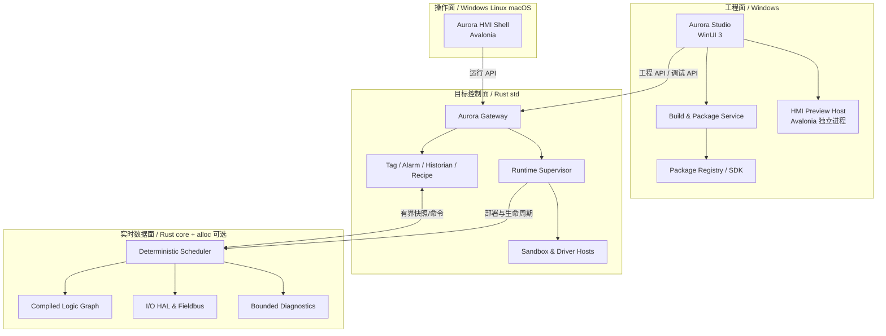
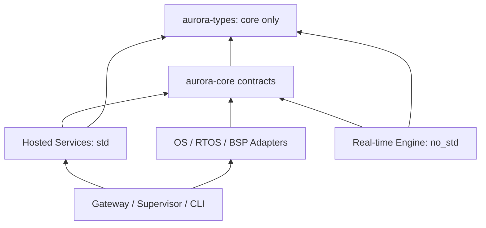

# Aurora 上位机平台总体架构方案

> 状态：提案（Draft）  
> 版本：0.1  
> 日期：2026-09-02  
> 范围：Rust 运行平台、Avalonia HMI、WinUI 3 工程 IDE、插件与部署体系

## 1. 结论先行

Aurora 不应被设计为一个“大型桌面程序”，而应是由工程工具、HMI、网关、非实时服务和实时执行引擎组成的平台。

首版采用以下六项基础决策：

1. **Rust 是平台核心，不是 UI 的附属 DLL。** 业务、设备接入、任务调度、变量、报警、历史和部署代理均由 Rust 承担；C# UI 只通过稳定契约访问核心。
2. **实时域和非实时域硬隔离。** 实时循环不得依赖 UI、网络请求、磁盘、数据库、垃圾回收或通用异步运行时；非实时服务通过有界队列交换快照和命令。
3. **Avalonia HMI 与 WinUI 3 IDE 分成两个产品。** HMI 面向 Windows/Linux/macOS；IDE 仅面向 Windows。两者共享工程模型、协议和设计令牌，不共享 UI 控件程序集。
4. **插件按安全等级分轨。** 非实时业务插件优先使用 WebAssembly Component + WIT；驱动插件使用隔离进程；实时插件必须静态链接并通过实时性审查；只有受信任的 UI 扩展可以进程内加载。
5. **所有工程和部署结果文件化、可审查。** 源工程使用文本文件，依赖通过锁文件固定；部署包不可变、可签名、可回滚。
6. **借鉴 CODESYS 的分层，而不复制其实现。** 保留“工程系统—网关—运行时—设备描述—库/包仓库”的成熟边界，并增加跨平台 HMI、能力安全、进程隔离和现代 CI/CD。

## 2. 目标与边界

### 2.1 目标

- 支持设备配置、业务编排、调试、监控、部署、HMI 设计及运行。
- HMI 支持 Windows、桌面 Linux 和 macOS。
- WinUI 3 IDE 提供 Windows 原生的复杂工程体验。
- Rust 核心覆盖普通桌面/服务器 OS、实时 Linux/POSIX 类系统以及 `no_std`/RTOS 适配路径。
- 支持设备、协议、业务逻辑、HMI 控件、IDE 工具和诊断等扩展。
- 同一份工程可以生成模拟、非实时和实时目标产物。
- 支持离线工程、现场局域网和远程运维三种使用方式。

### 2.2 首版非目标

- 不在第一阶段实现完整 IEC 61131-3 编程系统。
- 不承诺 Windows/macOS 普通进程具备硬实时能力。
- 不允许未经审查的动态插件进入硬实时循环。
- 不以“任意 RTOS 一次编译即可运行”为目标；每个 RTOS/板卡仍需要 BSP、工具链和平台适配层。
- 不在 Avalonia 与 WinUI 之间建立控件级互操作。

### 2.3 重要定义

- **工程面（Engineering Plane）**：项目编辑、编译、包管理、调试与部署。
- **操作面（Operation Plane）**：HMI、报警、趋势、配方和运维操作。
- **控制面（Control Plane）**：配置、生命周期、权限、命令和诊断。
- **实时数据面（Real-time Data Plane）**：确定性采样、运算、I/O 刷新和有界消息交换。
- **目标（Target）**：可部署 Aurora Runtime 的设备或系统。
- **组件（Component）**：平台内部具有明确接口和生命周期的模块。
- **插件（Plugin）**：由平台外部独立交付、具有清单和权限声明的扩展。

## 3. 总体逻辑架构



部署时并不要求所有方框位于同一台机器。实时控制器资源较小时，只部署实时引擎和精简代理；Gateway、历史库等可运行在伴随 IPC 或边缘计算机上。

## 4. 借鉴 CODESYS 的方式

| CODESYS 概念 | Aurora 对应设计 | Aurora 的调整 |
| --- | --- | --- |
| Development System | Aurora Studio | WinUI 3 外壳，后端能力通过协议和命令贡献 |
| Gateway | Aurora Gateway | 统一发现、认证、路由、在线调试和远程通道 |
| Runtime System | Aurora Runtime | Rust 实现，并严格拆分实时域与非实时域 |
| Device Tree | Project/Target/Device Graph | 文本化节点、稳定 UUID、Schema 校验 |
| Device Description | `.aurdevice` 设备包 | 声明能力、参数、I/O、驱动和兼容范围 |
| Library Repository / Placeholder | Registry + SemVer + Lockfile | 显式依赖解析、内容哈希、可重现构建 |
| Package Manager | Aurora Package Manager | 签名、权限、信任级别、隔离策略和回滚 |
| Visualization | Aurora HMI | 独立 Avalonia 运行时，跨 Win/Linux/macOS |

CODESYS 官方资料表明，其运行时负责工程通信、应用装载执行、调试、I/O/现场总线及安全；设备描述定义设备能力与连接关系；库仓库、占位符和包管理器解决复用及版本适配。Aurora 保留这些职责边界，但采用文本工程、独立进程、现代接口定义和不可变部署包。

## 5. 产品与进程划分

### 5.1 Aurora Studio（WinUI 3）

Studio 是 Windows 专用工程 IDE，主要模块如下：

- Workspace：解决方案、项目、目标、设备和资源树。
- Editors：设备参数、逻辑图、变量表、报警、配方、脚本和 HMI 页面编辑器。
- Build：依赖解析、Schema 校验、代码生成、Rust/插件构建和部署包生成。
- Online：发现、登录、下载、启动/停止、变量监控、强制值、跟踪和日志。
- Diagnostics：任务周期、抖动、WCET、队列水位、设备健康度和故障快照。
- Extension Shell：命令、菜单、工具窗格、编辑器和构建步骤贡献点。

Studio 只持有编辑状态，不作为工程语义的唯一实现。校验、编译、迁移和打包能力必须可通过 CLI/Build Service 无界面运行，以支持 CI/CD。

### 5.2 Aurora HMI Shell（Avalonia）

HMI Shell 是跨平台运行外壳：

- 加载签名的 `.aurhmi` 包。
- 渲染页面、模板、主题和本地化资源。
- 订阅 Tag、Alarm、Trend、Recipe 等运行 API。
- 实施角色权限、操作确认、审计和离线/重连状态。
- 使用平台适配服务处理文件、窗口、通知、键盘和触控差异。

HMI 不直接加载 Studio 的 WinUI 控件。Studio 中的 HMI 设计器维护中立的页面模型；预览时启动独立 Avalonia Preview Host，通过 IPC 接收页面模型和模拟数据。

### 5.3 Aurora Gateway（Rust）

Gateway 是工程工具和目标运行时之间的稳定边界：

- 目标发现、路由和连接复用。
- mTLS 身份认证、授权和审计。
- 工程 API、运行 API、调试 API 的版本协商。
- 本地命名管道/Unix Domain Socket 与远程 QUIC/TLS 通道适配。
- 限流、断线续传、部署包校验和多目标操作。

Gateway 不参与实时循环；网关断开不得导致实时任务停止。

### 5.4 Runtime Supervisor（Rust `std`）

- 管理安装槽 A/B、部署、启动、停止、健康检查和回滚。
- 加载目标配置和非实时组件。
- 管理 Tag、报警、历史、配方、脚本及插件宿主。
- 将实时计划和固定内存区交给 Real-time Engine。
- 监控实时心跳，但不持有实时循环所需的锁。

### 5.5 Real-time Engine（Rust `no_std` 优先）

- 执行离线编译后的任务计划和逻辑图。
- 完成输入采样、逻辑执行、输出提交和诊断采样。
- 仅使用预分配内存、有界容器和无阻塞通信。
- 通过 Port/HAL 接口接入时钟、线程/中断、共享内存和现场总线。

## 6. Rust 跨 OS 分层

### 6.1 依赖方向



底层 crate 不得反向依赖具体 OS、网络框架或 UI。建议的基础 crate 如下：

| Crate | `std` | `alloc` | 用途 |
| --- | --- | --- | --- |
| `aurora-types` | 否 | 否 | ID、时间、质量码、错误码、固定布局类型 |
| `aurora-rt-contracts` | 否 | 可选 | Task、I/O、时钟、队列、诊断 trait |
| `aurora-rt-engine` | 否 | 启动期可选 | 调度器、执行图、看门狗、快照 |
| `aurora-codec-fixed` | 否 | 否 | 固定上限帧、CRC、序列号、端序 |
| `aurora-model` | 是 | 是 | 完整工程与运行模型 |
| `aurora-services` | 是 | 是 | Tag、Alarm、Historian、Recipe |
| `aurora-gateway` | 是 | 是 | API、认证、路由和部署 |
| `aurora-platform-*` | 视目标而定 | 视目标而定 | Windows、Linux、PREEMPT_RT、RTOS/BSP 适配 |

通过 Cargo feature 明确能力，例如 `std`、`alloc`、`rt`、`simulation`、`trace`；CI 必须分别执行 `no_std` 和 hosted 构建，防止底层模块意外引入 `std`。

### 6.2 支持档位

| 档位 | 目标示例 | Rust 形态 | 实时定位 |
| --- | --- | --- | --- |
| H0 Hosted | Windows、普通 Linux、macOS | `std` | 仿真/非实时服务；不声称硬实时 |
| H1 Soft-RT | 调优后的通用 Linux/Windows | `std` + OS 调度适配 | 软实时，必须量测而非假定 |
| R1 RT Hosted | Linux PREEMPT_RT、具备 POSIX 接口的 RTOS | 精简 `std` 或 `no_std + alloc` | 可构建确定性系统，保证取决于 OS、驱动和硬件 |
| R2 RT Embedded | RTOS、裸机 MCU/SoC | `no_std`，`alloc` 可禁用 | BSP 级移植与静态链接 |

Rust 的 `no_std` 使平台无关核心不依赖操作系统运行时，但“能编译”不等于“满足硬实时”。硬实时结论必须由目标 OS 调度、驱动、中断、内存、缓存、总线和 WCET 测试共同证明。PREEMPT_RT 可降低调度延迟并提供优先级继承等机制，仍需要针对目标硬件验收。

首个建议基线：

- Hosted：Windows x64、Linux x64/ARM64。
- HMI：Windows x64/ARM64、主流桌面 Linux x64/ARM64、macOS x64/ARM64。
- RT：Linux PREEMPT_RT x64，随后扩展 ARM64。
- Embedded：选择一个明确 RTOS/板卡做 R2 概念验证，首版不泛化承诺所有 RTOS。

### 6.3 实时循环规则

推荐周期模型：

1. 等待单调时钟的绝对截止时间。
2. 锁存输入镜像。
3. 按离线生成的拓扑和优先级执行任务。
4. 原子提交输出镜像。
5. 将有界诊断样本推送给非实时域。
6. 记录 deadline miss，执行目标定义的降级或安全状态策略。

实时阶段禁止：

- 通用堆分配和不可控析构。
- 文件、数据库、DNS、HTTP 和阻塞日志。
- 无界队列、递归、不可界定循环和运行时插件发现。
- 等待非实时线程持有的 mutex。
- 在实时线程运行 Tokio、.NET 或 WebAssembly 插件宿主。

允许但必须封装和验证：固定容量容器、无锁 SPSC 队列、预注册回调、单调时钟、CPU 亲和性、优先级调度、锁页内存、预热后的代码路径。

## 7. 通信与数据模型

### 7.1 三类通道

| 通道 | 场景 | 建议实现 | 约束 |
| --- | --- | --- | --- |
| Control API | 配置、生命周期、调试、包管理 | Protobuf + gRPC；远程 TLS | 可版本化、可审计，不进实时环 |
| Local Data | 同机高频 Tag/趋势 | 共享内存 + SPSC Ring + 控制 IPC | 固定槽位、背压、读者掉线不阻塞写者 |
| RT Link | RT 核与伴随主机/现场设备 | 固定帧二进制协议 | 无堆、序列号、时间戳、CRC、最大帧长 |

远程实时数据应由 Gateway 对共享内存快照进行降采样和复用，避免每个 HMI 客户端直接给实时域施加负载。

### 7.2 契约管理

- `Contracts/proto/`：工程、运行、调试和部署 API。
- `Contracts/wit/`：沙箱插件接口。
- `Contracts/schema/`：工程、设备、HMI 和包清单 JSON Schema。
- `Contracts/rt/`：实时固定布局及生成规则。
- 每个公开接口具有独立版本；破坏性升级使用新 package/service 名称。
- C# 与 Rust 客户端均由契约生成，不手工复制 DTO。
- 部署包记录 API、设备、插件和运行时的兼容范围及内容哈希。

### 7.3 Tag 语义

每个运行变量至少包含：

- 稳定 `TagId`，名称仅用于显示和路径解析。
- 数据类型、工程单位、读写属性和访问角色。
- Source Timestamp、Server Timestamp。
- Quality：`Good / Uncertain / Bad` 及细分原因。
- 可选的量程、死区、刷新率和历史策略。

命令写入必须带请求 ID、调用者、期望版本/时间戳和超时，避免断线重试造成重复动作。安全相关操作应支持双确认或工作流审批。

## 8. 插件与组件模型

### 8.1 插件分类

| 类型 | 示例 | 执行位置 | 默认隔离 | 是否允许进入 RT 循环 |
| --- | --- | --- | --- | --- |
| Logic Component | 计算、转换、规则 | Wasm Host / Rust 服务 | Wasm capability sandbox | 否 |
| Connector | MES、MQTT、REST | 独立 Plugin Host | 进程 + capability | 否 |
| Device Driver | 相机、DAQ、总线 | Driver Host 或目标适配层 | 进程；必要时 native | 仅经专门 RT 版本 |
| RT Component | PID、运动块、快速 I/O | RT Engine | 静态链接、构建期组合 | 是 |
| HMI Widget | 仪表、趋势、工艺控件 | Avalonia HMI | 声明式/Wasm；受信任程序集可选 | 否 |
| IDE Extension | 编辑器、命令、工具窗格 | Studio/Extension Host | 默认进程外；受信任程序集可选 | 否 |
| Device Package | 参数、I/O、图标、驱动映射 | Studio + Runtime | 数据包 + 签名 | 不直接执行 |

### 8.2 为什么采用双轨插件

WebAssembly Component 使用 WIT 定义组件导入/导出契约，适合跨语言、跨 OS、能力受限的非实时扩展；组件之间不依赖共享线性内存，便于隔离和版本检查。但 Wasm 引擎、JIT/AOT、宿主调用和资源计量会增加时延不确定性，因此不得默认进入硬实时循环。

实时扩展采用“源码/预认证库 + 构建期组合”：

- 实现 `aurora-rt-contracts` 中的受限 trait。
- 编译进目标镜像，不在运行期装卸。
- 无堆或只允许初始化期分配。
- 声明最大执行时间、栈、输入输出规模和失败策略。
- 通过静态分析、目标机压力测试和签名审批后才可发布。

### 8.3 插件清单示例

```toml
schema = 1
id = "com.example.modbus-connector"
name = "Modbus Connector"
version = "1.2.0"
kind = "connector"
entry = "components/modbus.wasm"

[compatibility]
platform_api = ">=1.0, <2.0"
targets = ["windows-x64", "linux-x64", "linux-arm64"]

[capabilities]
network = ["tcp-client"]
device = ["serial"]
filesystem = []
secrets = ["modbus.credentials"]

[resources]
memory_bytes = 67108864
cpu_millis_per_second = 200
open_handles = 32
```

### 8.4 Component Manager 职责

- 扫描清单并校验签名、哈希和发布者信任。
- 解析 SemVer 依赖，生成 `aurora.lock`。
- 协商平台 API 和 capability。
- 选择 Wasm、进程外、进程内或静态链接的加载策略。
- 管理启动、停止、健康、升级、熔断和配额。
- 记录软件物料清单（SBOM）和审计事件。
- 支持并行安装多个版本，但一个部署必须锁定唯一解析结果。

### 8.5 UI 扩展边界

HMI 控件优先由以下三层组成：

1. 平台内置 Avalonia 控件和主题。
2. 声明式 Widget：Schema + 模板 + 样式 + Wasm 行为，默认选择。
3. 受信任 Avalonia 程序集：仅对需要自定义渲染或硬件集成的供应商开放。

IDE 扩展默认贡献命令、菜单、属性页描述和编辑器协议，由 Extension Host 执行业务逻辑。必须使用自定义 WinUI 控件时，才允许签名且版本严格匹配的进程内扩展。进程内 UI 扩展无法提供真正的崩溃隔离，应视为最高信任等级。

## 9. 工程、构建与部署模型

### 9.1 文件化工程

建议工程结构：

```text
MyMachine/
  aurora.project.json
  aurora.lock
  Targets/
  Devices/
  Logic/
  Hmi/
  Alarms/
  Recipes/
  Assets/
  Tests/
```

规则：

- 每个对象一个文件，使用稳定 UUID，便于 Git diff/merge。
- 格式化和字段排序由 CLI 统一执行。
- 密钥、证书私钥和现场密码不进入工程；只保存 Secret 引用。
- Schema 迁移可重复、可回退，并保留迁移日志。
- 工程保存与目标下载分离，禁止直接把可编辑源工程当部署产物。

### 9.2 构建流水线


Canonical IR 是 Studio、CLI 和编译器之间的唯一语义中间层。IDE 不应生成只有自身能解释的隐藏状态。

### 9.3 包格式

- `.aurpkg`：完整目标部署包。
- `.aurplugin`：非实时插件及资源。
- `.aurdevice`：设备描述、参数 Schema、I/O 和驱动映射。
- `.aurhmi`：HMI 页面、资源、主题和 Widget 依赖。
- `.aursdk`：开发契约、生成器和模板集合。

包本质可采用 ZIP/OCI Artifact，但对外只承诺 Aurora 清单和签名语义。部署必须先上传暂存槽、校验签名与兼容性、进行预启动检查，再原子切换；启动失败自动回滚。

## 10. 运行时状态与故障策略

目标生命周期建议为：

```text
Unprovisioned -> Provisioned -> Installed -> Ready -> Running
                                      |          |
                                      v          v
                                    Fault <--- Degraded
                                      |
                                      v
                                  Rollback/Safe
```

- `Degraded`：非关键组件失败，控制任务仍可按已定义策略运行。
- `Fault`：关键契约、I/O 或 deadline 连续失败。
- `Safe`：执行目标定义的安全输出；安全策略必须离线验证且不可由普通 HMI 插件覆盖。
- 实时域与 Supervisor 各有独立看门狗，避免单向“假活”。
- 日志、指标和跟踪统一携带 Target、Deployment、Component、Task 和 Correlation ID。

## 11. 安全设计

- 设备首次配置建立唯一身份，远程通道使用 mTLS。
- 工程用户、运行操作员、服务账户和插件发布者分离。
- RBAC 管理常规权限；高风险操作增加目标、时间和条件约束。
- 所有部署包、插件和设备包必须支持签名和吊销。
- 插件 capability 默认拒绝；文件、网络、串口、秘密和宿主 API 分别授权。
- 强制值、配方下发、安全旁路、部署、回滚和证书变更进入不可抵赖审计。
- Gateway 不把实时内存直接暴露给网络；所有写操作经过类型、范围、状态和权限校验。
- 发布过程生成 SBOM，锁定工具链、依赖和构建容器摘要。

## 12. 仓库建议布局

```text
AuroraApp/
  Sources/
    Rust/
      crates/
        aurora-types/
        aurora-rt-contracts/
        aurora-rt-engine/
        aurora-services/
        aurora-gateway/
        aurora-supervisor/
        aurora-platform-windows/
        aurora-platform-linux/
        aurora-platform-preempt-rt/
      apps/
      Cargo.toml
    DotNet/
      Aurora.Hmi/
      Aurora.Hmi.Core/
      Aurora.Hmi.PreviewHost/
      Aurora.Studio/
      Aurora.Studio.Core/
      Aurora.Sdk/
    Contracts/
      proto/
      wit/
      schema/
      rt/
    Sdk/
      Rust/
      DotNet/
      Templates/
  Documents/
    Architecture/
    ADR/
    Protocols/
    PluginSDK/
  Tools/
    CodeGen/
    Packaging/
    DevEnvironment/
  Builds/
```

`Aurora.Studio.Core` 只保存不依赖 WinUI 的工程会话、命令模型和客户端逻辑；`Aurora.Hmi.Core` 只保存 HMI 模型与运行客户端。可以共享生成 DTO、设计令牌和 Schema，但不得通过一个“公共 UI 项目”同时引用 Avalonia 与 WinUI。

## 13. 建议技术基线

| 领域 | 基线 | 备注 |
| --- | --- | --- |
| Rust | 固定 stable toolchain | `rust-toolchain.toml` 锁定；目标工具链单独记录 |
| .NET | .NET LTS | HMI/IDE/生成客户端统一主版本 |
| HMI | Avalonia Desktop | Windows/Linux/macOS；平台差异通过接口适配 |
| IDE | WinUI 3 / Windows App SDK | Windows 专用，优先 unpackaged/self-contained 评估插件体验 |
| Control API | Protobuf + gRPC | 对外接口版本化，C#/Rust 生成客户端 |
| Plugin ABI | WebAssembly Component + WIT | 先做兼容性和 AOT/启动时延验证，再冻结宿主版本 |
| Local Data | Shared Memory + bounded SPSC | 控制 IPC 只负责协商内存布局和生命周期 |
| Observability | OpenTelemetry 语义 + 平台实时诊断 | 实时域只写有界二进制事件 |
| Package | 内容寻址 + 签名 + SBOM | 可映射到文件仓库或 OCI Registry |

## 14. 分阶段落地

### Phase 0：架构验证（建议 4～6 周）

- Rust Gateway 与 C# 生成客户端完成双向 API、重连和版本协商。
- 同一 Avalonia HMI 示例在 Windows/Linux/macOS 运行。
- WinUI Studio 外壳连接模拟目标，并通过独立 Preview Host 预览 HMI。
- PREEMPT_RT 上运行 1 kHz 基准循环，记录 p50/p99.9/max 抖动和 deadline miss。
- `aurora-types`、`aurora-rt-contracts` 完成 `no_std` 构建。
- 完成一个 WIT/Wasm 非实时插件和一个静态 RT 组件。
- 完成签名包、A/B 安装和失败回滚闭环。

### Phase 1：平台最小闭环

- 工程树、设备描述、Tag、部署、在线监控。
- Modbus TCP/串口等一个进程外 Connector。
- HMI 基础控件、报警列表、趋势和权限。
- 模拟运行时和 CI 无界面构建。

### Phase 2：实时与设备生态

- 离线任务计划、WCET 预算和运行诊断。
- PREEMPT_RT 正式适配、CPU/内存/IRQ 调优工具。
- Driver Host SDK、设备包 SDK、兼容性测试套件。
- ARM64 RT 目标和选定 RTOS/板卡 PoC。

### Phase 3：IDE 与插件生态

- 图形逻辑编辑器、扩展工具窗格、插件仓库。
- HMI Widget SDK、工程迁移器和包签名服务。
- 多目标批量部署、远程运维和审计导出。

## 15. 架构验收指标

- Gateway 或 HMI 崩溃/断网时，RT 循环不受影响。
- RT crate 在 CI 中可使用 `no_std` 目标构建，实时路径无运行期堆分配。
- 插件无权限时无法访问网络、文件、设备或 Secret。
- 同一锁文件在干净环境生成相同内容哈希的部署包。
- 部署中断不会破坏当前运行槽，激活失败可自动回滚。
- Studio 和 CLI 对同一工程产生相同 IR 和诊断结果。
- HMI 包无需重新编译 Rust Runtime 即可更新；Runtime API 不兼容时在部署前明确拒绝。
- 每个正式 RT 目标都具有可复现的延迟测试报告，而不是仅以平均周期作为依据。

## 16. 需要尽早确定的产品决策

1. 第一个正式实时目标：PREEMPT_RT、QNX、VxWorks 或指定 RTOS/板卡。
2. Aurora 是否提供自有逻辑语言/图，或首期只承载 Rust/Wasm/脚本和设备流程。
3. HMI 设计器首期是否需要自由画布、响应式布局和自定义 Widget SDK 全部能力。
4. 第三方插件的商业签名、许可证和私有仓库策略。
5. 目标安全等级与行业合规范围；功能安全不能通过通用插件框架顺带获得。

在这些决策确定前，建议以 PREEMPT_RT x64、文本工程、Protobuf 控制 API、WIT 非实时插件和静态 RT 组件作为最小架构基线。

## 17. 参考资料

- [CODESYS Development System](https://www.codesys.com/products/engineering/development-system/)
- [CODESYS Control Runtime System](https://www.codesys.com/device-manufacturers/codesys-for-you/your-device-with-codesys/)
- [CODESYS Device Tree and Device Description](https://content.helpme-codesys.com/en/CODESYS%20Development%20System/_cds_device_tree_device_editor.html)
- [CODESYS Library Repository and Library Manager](https://content.helpme-codesys.com/en/CODESYS%20Development%20System/_cds_struct_installing_libraries.html)
- [CODESYS Package Manager](https://content.helpme-codesys.com/en/CODESYS%20Development%20System/_cds_struct_managing_packages_and_licenses.html)
- [Avalonia cross-platform architecture](https://docs.avaloniaui.net/docs/fundamentals/cross-platform-architecture)
- [Avalonia desktop platform documentation](https://docs.avaloniaui.net/docs/welcome)
- [Microsoft WinUI 3](https://learn.microsoft.com/en-us/windows/apps/winui/winui3/)
- [The Embedded Rust Book: `no_std`](https://doc.rust-lang.org/stable/embedded-book/intro/no-std.html)
- [Linux kernel PREEMPT_RT theory of operation](https://docs.kernel.org/core-api/real-time/theory.html)
- [WebAssembly Component Model: Components](https://component-model.bytecodealliance.org/design/components.html)
- [WebAssembly Component Model: WIT](https://component-model.bytecodealliance.org/design/wit.html)
