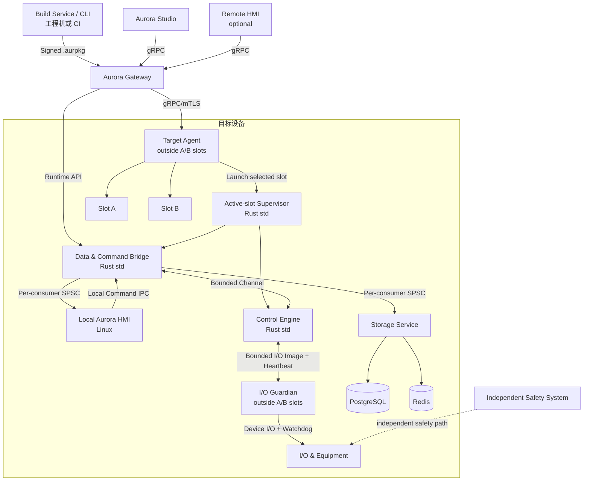
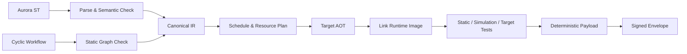

# Aurora Runtime 架构方案

> 状态：已接受（Accepted）<br>
> 版本：1.0<br>
> 日期：2026-09-02<br>
> 范围：Aurora ST、工作流、Runtime、Target Agent、部署、通信、数据与持久化边界

## 1. 文档定位

本文档固化 Aurora Runtime 第一阶段的已确认架构决策，是 Runtime 实现、接口设计和验收的直接依据。平台长期方向参见 [Aurora 上位机平台总体架构方案](Aurora-Platform-Architecture.md)。

Aurora 借鉴 CODESYS 的工程、应用、目标和运行时分层，但不追求 CODESYS 源码兼容，也不实现 Online Change。Aurora 首版采用自定义 Aurora ST、显式双层工作流和完整镜像 A/B 更新。

Aurora 只支持普通 Linux x64 和 Rust `std`，不保留 RT-Linux、PREEMPT_RT、RTOS 或 `no_std` 兼容边界。默认部署允许 Control Engine、Hosted Services、Storage Service、PostgreSQL 和可选 Redis 同机运行。

## 2. 已接受决策

| ID | 决策 | 结果 |
| --- | --- | --- |
| R-001 | 产品推进顺序 | Runtime → HMI → Gateway → IDE |
| R-002 | Runtime OS 范围 | 只支持普通 Linux x64，不规划实时 OS/RTOS |
| R-003 | Rust 运行时边界 | 全部使用 Rust `std`；周期控制与 Hosted 服务保持逻辑隔离 |
| R-004 | 控制语言 | 自定义 Aurora ST 方言，不声明 IEC/CODESYS 源码兼容 |
| R-005 | ST 执行形式 | 工程机或 CI 进行 AOT，生成目标原生代码 |
| R-006 | 工作流模型 | Cyclic Workflow 与 Hosted Workflow 显式分离 |
| R-007 | 工作流表现 | Cyclic Workflow 是 LD 的可视化替代；不采用触点/线圈语法，并提供 PLC 扫描时序视图 |
| R-008 | 程序更新 | 完整镜像 A/B；不支持 Online Change |
| R-009 | 更新期间状态 | 内部运行状态全部重新初始化，持久数据外置 |
| R-010 | 激活策略 | 进入预定义 `Fallback` 后停止、切槽、自检和恢复 |
| R-011 | 持久化边界 | 统一 Storage Service；PostgreSQL 持久化，Redis 用于可重建数据 |
| R-012 | 远程协议 | Protobuf + gRPC/HTTP2/TLS，不引入 QUIC |
| R-013 | 本地高频数据 | 每个消费者独立 SPSC Ring |
| R-014 | Ring 溢出 | 按数据类型制定策略，周期控制生产者永不阻塞 |
| R-015 | 设备管理 | Gateway + Target Agent 两层模型 |
| R-016 | 设备身份 | 首次现场配对、唯一设备证书和 mTLS |
| R-017 | 时间模型 | 单调时钟 + UTC + `TimeQuality` |
| R-018 | 包签名 | 确定性 Payload + 独立签名 Envelope |
| R-019 | 功能安全 | 路线 A；功能安全由独立安全系统承担 |
| R-020 | HMI 部署 | 首版本机 HMI 与 Runtime 同机部署在 Linux x64；共享内存读、本地 IPC 写 |
| R-021 | 更新期 I/O 保护 | A/B 槽外常驻 I/O Guardian + 设备原生 watchdog；Guardian 负责执行并维持 `Fallback` |
| R-022 | 目标生命周期职责 | 槽外 Target Agent 独占安装/A/B；槽内 Supervisor 管理本槽进程；Hosted Services 不管理部署 |
| R-023 | 性能定位 | 首版只测量和报告，不定义参考硬件、最低周期、容量等级或平台合格线 |
| R-024 | ST 数值类型 | 固定宽度整数与 IEEE 754 浮点；只允许无损隐式扩宽 |
| R-025 | ST 整数溢出 | 无法证明安全时必须显式选择 checked、saturating 或 wrapping 运算 |
| R-026 | ST 算术异常 | 除零、非法浮点及非有限结果使当前任务进入确定性 Fault |
| R-027 | Function Block 生命周期 | PLC 风格静态实例；状态跨周期保留，复位、重启和 A/B 切换时重新初始化 |
| R-028 | 物理 I/O 所有权 | Guardian 统一拥有物理 I/O；Control Engine 只访问 I/O 映像 |
| R-029 | Guardian Contract | 独立版本化并至少支持 N/N-1；Fallback 配置使用 active/pending 双版本 |
| R-030 | 输出保护等级 | 每个输出声明 Guardian、设备 watchdog 或外部安全保护要求，激活前校验 |
| R-031 | 系统资源授权 | Target Agent/systemd 建立资源边界；槽内 Supervisor 无特权运行 |
| R-032 | 周期 Fault 原子性 | 丢弃本周期输出并锁定任务；重新初始化后才能恢复 |
| R-033 | Deadline 策略 | 每任务配置 HardLimit、统计窗口、连续 miss 和 Fallback 策略 |
| R-034 | 性能准入 | 工程预算、目标型号压力测试和 Target Profile 匹配三层验证 |
| R-035 | Cyclic 数据容量 | 只允许固定容量字符串、数组、结构和状态；动态数据留在 Hosted 层 |
| R-036 | 越界与容量错误 | 数组越界和字符串容量不足使当前任务进入 Fault，不静默截断 |
| R-037 | PLC 地址兼容 | ST 使用统一 `%I/%Q/%M`；厂商地址在 Device Mapping 中绑定 |
| R-038 | 输出仲裁 | 每输出单一正常写入者；Manual/Force 使用显式租约，Fallback 优先 |
| R-039 | Cyclic Workflow 定位 | 作为 LD 的可视化替代，提供工作流画布与 PLC 扫描时序视图 |
| R-040 | Workflow 扫描语义 | 节点每周期最多执行一次；状态转移和输出在周期末提交 |
| R-041 | Workflow 并行 | 逻辑并行、单线程静态顺序；Fork/Join 和取消策略显式声明 |
| R-042 | 循环边界 | 流程回边跨周期；ST 循环必须具有可证明的最大迭代次数 |
| R-043 | Hosted Workflow 恢复 | 至少一次执行、稳定 OperationId、事务 Outbox、幂等或补偿 |
| R-044 | Alarm 过载 | 当前状态可恢复；历史缺口必须通过序列、计数和系统告警暴露 |
| R-045 | 本地数据恢复 | 完整快照 + 增量流 + Epoch + Schema Hash；缺口后重新同步 |
| R-046 | 断电安全激活 | 持久化 active/pending/last_good、阶段和启动次数 |
| R-047 | 数据库升级 | Expand/Contract 迁移与回滚兼容窗口；不可逆迁移进入维护流程 |
| R-048 | 槽外组件更新 | 独立维护通道、staged install、健康检查和 Recovery Launcher |
| R-049 | HMI 生命周期 | HMI 独立 staged update/rollback，并与新槽和回滚槽做契约校验 |
| R-050 | Secret 管理 | 槽外 Secret Store；包只保存引用，服务按 capability 临时访问 |
| R-051 | 防回退 | SecurityEpoch、ReleaseSequence、安全下限和受控降级授权 |
| R-052 | 本地 IPC 安全 | 系统进程、组件、用户会话和命令四层身份与授权 |
| R-053 | 审计持久化 | 槽外防篡改 WAL；高风险操作先记录后执行 |
| R-054 | PostgreSQL 可用性 | 首版单实例 + WAL 归档 + 外部备份 + 恢复演练，不承诺自动 HA |
| R-055 | 插件开放顺序 | 先静态/声明式能力，再 Hosted Wasm，最后 UI/IDE 扩展 |
| R-056 | HMI 设计能力 | 首版完整响应式布局；Widget 先使用无代码的参数化组合组件 |
| R-057 | 插件商业底座 | 首版支持签名、许可证元数据、离线授权接口和私有仓库，不建设完整商城 |
| R-058 | 安全合规基线 | IEC 62443-4-1、4-2 要求映射与 NIST SSDF；认证按目标市场推进 |
| R-059 | 发布供应链 | 构建、验证、审批和生产签名分离，携带可验证来源证明 |
| R-060 | 设备生命周期 | 物理在场配对、分级恢复、安全出厂重置和证书吊销 |
| R-061 | 跨任务数据 | 单写者、多读者、周期快照；不共享锁或可变 FB 实例 |
| R-062 | I/O 周期同步 | Guardian I/O Update Group 与任务释放、输出窗口进行相位同步 |
| R-063 | 进程恢复 | Control Critical、Runtime Essential、Hosted Optional 分级重启与熔断 |
| R-064 | 资源耗尽 | 分级硬限制和有序降级，优先保护 Guardian、Control Engine 与恢复通道 |
| R-065 | 数据保留 | 按数据类别设置保留、降采样、配额、离线缓存和归档规则 |
| R-066 | 时间质量 | 显式 TimeQuality 状态机；控制使用单调时钟，绝对时间业务分级降级 |
| R-067 | 在线调试 | Observe/Commissioning/Debug 分级；只在扫描或节点边界暂停 |

## 3. 目标与非目标

### 3.1 首阶段目标

- 建立可在普通 Linux x64 上运行和测试的 Rust Runtime。
- 使用普通 Linux x64 和 Rust `std` 构建完整运行平台，并支持 PostgreSQL/Redis 同机部署与观测。
- 实现 Aurora ST 的解析、语义检查、Canonical IR、AOT 和目标原生代码生成。
- 实现 Cyclic Workflow 的有界周期状态机和 Hosted Workflow 的异步执行模型。
- 实现 I/O 镜像、周期调度、有界通信、诊断和 `Fallback`。
- 实现完整镜像构建、签名、A/B 安装、受控激活和失败回滚。
- 先通过 CLI、仿真设备和自动化测试验收，不等待 HMI、Gateway 或 IDE。

### 3.2 非目标

- 不实现 Online Change、POU 热替换或运行中原生代码重定位。
- 不声明 Aurora ST 与 IEC 61131-3 ST 或 CODESYS ST 源码兼容。
- 不把工作流实现为梯形图、SFC 或其他现有图形语言的别名。
- 不支持 RT-Linux、PREEMPT_RT、RTOS、裸机或 `no_std` 目标，也不声明硬实时能力。
- 周期控制线程不直接访问网络、磁盘、数据库、Redis 或无界队列；这些能力由同机 Hosted Services 通过有界通道提供。
- 不让 Target 在生产环境编译 Aurora ST。
- 不在 Runtime 内持久保存跨版本业务状态。
- 不由 Aurora 承担经认证的功能安全功能。

## 4. 逻辑与部署拓扑



实施顺序不改变最终边界：本机 Linux HMI 通过 Data Bridge 的共享内存 SPSC 和本地命令 IPC 工作，不依赖 Gateway。Gateway 尚未完成时，CLI 可通过同一套 Protobuf 契约连接 Target Agent 的本地管理端点；Gateway 完成后只增加远程路由入口，不重新定义 Runtime API。

## 5. Runtime 模块边界

### 5.1 Control Engine（Rust `std`）

Control Engine 承担周期控制能力：

- 基础 ID、数值、时间间隔、质量码和错误码。
- Aurora ST 编译产物的运行契约。
- Cyclic Workflow 状态机和静态执行计划。
- 周期调度状态，以及与 I/O Guardian 交换的输入/输出镜像和原子内存提交。
- 固定容量容器、有界 SPSC、看门狗状态和二进制诊断事件。
- Linux 时钟、线程、内存和 I/O 契约适配。

Control Engine 可以使用 Rust `std`，但周期执行路径禁止直接调用数据库、Redis、DNS、HTTP、阻塞文件 I/O、阻塞日志和无界队列。初始化、部署和非周期路径不受该限制。

### 5.2 Runtime Supervisor（Rust `std`，应用槽内）

每个应用槽携带与该版本匹配的 Supervisor。槽外 Target Agent 选择活动槽并启动其中的 Supervisor；Supervisor 只管理本槽运行进程：

- 启动、停止和监控本槽的 Control Engine、Data Bridge、Storage Service 与其他 Hosted Services。
- 在 Target Agent/systemd 已创建并委派的无特权 scope 内启动进程；Supervisor 只能请求签名清单中已获准的 CPU、内存、文件句柄和服务账户配置，不能修改槽外服务或系统策略。
- 汇总本槽健康状态并报告给 Target Agent，不执行安装、切槽、签名验证或回滚。
- Supervisor 崩溃时，由 Target Agent 检测并保持当前活动槽身份；I/O Guardian 独立进入或维持 `Fallback`。

### 5.3 Hosted Services（Rust `std`）

Hosted Services 与 Control Engine 同机运行，负责：

- 业务线程、异步任务和本槽内服务资源的使用。
- gRPC、本地 IPC、共享内存与消费者会话。
- Storage Service、PostgreSQL/Redis 访问、日志导出和 OpenTelemetry 适配。
- Hosted Workflow、报警、历史、配方和其他允许阻塞或异步执行的能力。

Hosted Services 不读取部署包、不选择 A/B 槽、不启动其他平台进程，也不决定激活或回滚。

逻辑隔离用于保护周期控制不受数据库抖动影响，不再作为实时 OS、`no_std` 或跨平台移植边界。

服务恢复分为三类：Control Engine 属于 `Control Critical`，崩溃后 Guardian 立即维持 Fallback，新进程使用新 Epoch 并重新初始化；Supervisor、Data Bridge、Storage Service 属于 `Runtime Essential`，后两者可独立重启，Supervisor 崩溃时 Target Agent/systemd 终止本槽孤儿进程并重新启动整个槽；Connector、Historian、Hosted Workflow 和非关键插件属于 `Hosted Optional`，使用有界重试、指数退避和熔断，超过预算后保持 Degraded。

资源保护顺序为 Guardian > Control Engine > Target Agent/Supervisor > Data Bridge > Storage Service > HMI > Hosted/插件。Target Agent/systemd 通过 cgroups 强制 CPU、内存、I/O、进程数和句柄限制；控制工作集启动时预分配并预触页，周期路径不使用普通 Swap。过载时先限流或熔断 Hosted 能力；Control Engine 自身超过声明上限时 Fault 并由 Guardian 接管。部署槽、PostgreSQL、审计 WAL、Historian 和普通日志使用独立配额，Target Agent 始终保留最小恢复资源。

### 5.4 I/O Guardian（Rust `std`）

I/O Guardian 是独立于应用 A/B 槽的常驻进程，拥有现场设备和总线的排他访问权：

- 向 Control Engine 发布带 epoch、序列号和时间戳的有界输入镜像。
- 接收 Control Engine 的输出镜像、运行状态和租约心跳，拒绝过期 epoch 或乱序输出。
- Runtime 正常停止、崩溃、心跳超时或 A/B 切换时，在配置的最大响应时间内应用并维持 `Fallback`。
- 向支持 watchdog 的设备持续发送设备原生心跳；Guardian 自身失效时，由设备 watchdog 执行第二层预设输出。
- 在停止旧 Runtime 前校验并预装已签名 Payload 中的 `Fallback` 配置；配置不完整、设备不支持或验证失败时拒绝激活。

所有物理设备驱动均属于 Guardian 控制域。低延迟、可信驱动静态编译进 Guardian；可能阻塞或不可信的驱动可运行于 Guardian 管理的隔离 Driver Host，但 Control Engine 始终只读写共享 I/O 映像，不直接打开设备文件、串口、现场总线或设备网络连接。

Guardian Contract 独立版本化并至少兼容当前版与上一版 Runtime。租约建立前协商 ABI、共享布局和 capability；Fallback 配置保存 `active/pending` 双版本，只在新槽完成健康确认后提交。每个输出声明 `GuardianProtected`、`DeviceWatchdogProtected` 或 `ExternalSafetyProtected`，Target Agent 在激活前验证设备能力，不满足工程保护等级时拒绝激活。

Guardian 只保证普通控制系统的运行保护，不是功能安全组件。Guardian 本体和基础 OS 不属于应用 A/B 槽；其升级使用独立维护流程，不能与普通应用激活同时进行。

### 5.5 建议 crate 边界

```text
aurora-types
aurora-control-contracts
aurora-control-engine
aurora-io-guardian
aurora-st-ir
aurora-workflow-cyclic
aurora-workflow-hosted
aurora-platform-linux
aurora-runtime-supervisor
aurora-target-agent
aurora-data-bridge
aurora-storage-service
aurora-build                 host only
aurora-cli                   host only
```

## 6. Aurora ST 与工作流

### 6.1 Aurora ST

Aurora ST 是受 ST 风格启发的自定义控制语言。它可以保留变量声明、结构化条件、循环、函数和功能块等熟悉形式，但语法、类型系统、初始化、溢出、浮点和调用规则由 Aurora 规范独立定义。

必须提供：

- 版本化语言规范和语法文法。
- 确定的数据类型宽度、字节序和数值转换规则。
- 明确的整数溢出、除零、浮点异常和数组越界行为。
- POU、Function、Function Block、Program 和实例生命周期规则。
- 源码到 Canonical IR、原生地址和诊断位置的 Source Map。
- 跨编译器版本的源码与 IR 兼容策略。

#### 6.1.1 类型、容量与转换

- 有符号整数为 `SINT/INT/DINT/LINT`，无符号整数为 `USINT/UINT/UDINT/ULINT`，宽度固定为 8/16/32/64 位。
- `REAL` 与 `LREAL` 分别遵循 IEEE 754 binary32/binary64；`BOOL` 不参与数值隐式转换。
- 只允许可证明无损的隐式扩宽；缩窄、跨有无符号、整浮转换必须显式书写。
- Cyclic ST 只允许 `STRING[N]`、`WSTRING[N]`、定长 `ARRAY`、固定布局 `STRUCT` 和固定容量容器；周期路径禁止动态增长和普通堆分配。
- Function Block 必须静态声明，状态跨周期保留；任务复位、进程重启和 A/B 切换均按声明重新初始化。禁止动态实例和递归调用。

#### 6.1.2 确定性错误语义

- 常量表达式溢出是编译错误。运行期整数运算在无法证明安全时必须显式选择 checked、saturating 或 wrapping 语义。
- 普通除法允许书写；整数除零、非法浮点运算和产生 `NaN/±Inf` 时当前任务 Fault。
- 动态数组索引必须做边界检查；字符串写入和拼接必须检查目标容量。越界或容量不足时 Fault，不允许静默截断或内存越界。
- 发生 Fault 后丢弃本周期输出，任务进入锁定状态；Guardian 对该任务输出执行 Fallback。任务重新初始化后才能恢复，不允许从半修改的 FB 状态继续。

#### 6.1.3 PLC 地址兼容

```iecst
VAR_GLOBAL
    StartButton AT %IX0.0 : BOOL;
    SpeedCommand AT %QW2 : UINT;
    WorkCounter AT %MD100 : DINT;
END_VAR
```

- `%I` 是 Guardian 发布的只读输入映像。
- `%Q` 是输出命令映像；读回表示命令值，不等同于设备反馈。
- `%M` 是 Runtime 内部非持久内存，任务重新初始化和 A/B 切换时重置。
- Siemens `DB1.DBW0`、Mitsubishi `D100`、Modbus `40001` 等原始地址只存在于 Device Mapping，不进入 Aurora ST 核心语法。
- 构建期校验范围、类型宽度、读写方向、重叠、对齐、字节序和位序；ST 不得借地址语法绕过 I/O Guardian。

### 6.2 显式双层工作流

#### Cyclic Workflow

- 静态拓扑、固定容量状态和有界循环。
- 只允许调用周期控制安全的 Aurora ST POU、I/O 节点和 Cyclic 子工作流。
- 禁止网络、数据库、人工等待、动态节点和无界重试。
- 编译期计算资源上限，部署前验证周期执行预算。

#### Hosted Workflow

- 由 `std` Hosted Service 执行。
- 允许网络、数据库、人工确认、暂停、超时、重试和补偿。
- 长流程状态通过 Storage Service 保存。
- 不直接读写 Control Engine 内存，只通过版本化命令、事件和状态快照交互。

两类工作流在 Studio 中必须显式创建和标识；禁止在单张图中由编译器隐式跨域切分。

Cyclic Workflow 是 Aurora 对梯形图（LD）的可视化替代控制语言：它不使用触点、线圈或梯级语法，但采用确定性的 PLC 扫描执行和调试体验。Studio 必须同时提供工作流画布与扫描时序视图，显示 I/O、内部变量、FB 状态、活动节点、转移、周期耗时、Fault、Force、Fallback 和 deadline miss；支持在线跟踪与离线回放。

#### 6.2.1 Cyclic 扫描语义

1. 周期开始时锁存输入、跨任务快照和当前活动节点集合。
2. 按编译期静态顺序执行活动节点；每个节点每周期最多执行一次。
3. 下游计算可以读取本周期上游计算结果，但状态转移只生成下一活动集合。
4. 周期成功结束后统一提交 Workflow 活动状态和输出；新激活的状态节点从下一周期执行。
5. Fault 时不提交 Workflow 活动状态和输出。已经发生的私有 FB/Program 半更新状态不得再被执行或作为有效运行状态发布，任务锁定后在复位时整体重新初始化并丢弃这些状态。

#### 6.2.2 Fork、Join 与循环

- 并行分支是逻辑并行，在同一周期任务中按静态顺序执行，不创建额外线程。
- `Fork` 激活多个分支；`Join All` 等待全部完成；`Join Any` 必须显式选择 `Cancel Others`、`Keep Running` 或 `Wait At Boundary`。
- 分支不得同时写同一变量或输出；编译器拒绝写入冲突。
- Workflow 回边只在下一周期生效。等待节点可以跨周期长期保持，但必须声明超时、最大次数或明确的永久等待策略。
- ST `FOR` 边界必须可确定最大迭代次数；`WHILE/REPEAT` 只有编译器能证明上限时才可用于 Cyclic。无法证明上限的循环只能进入 Hosted 层。

#### 6.2.3 Hosted 恢复语义

- 每个实例和有外部副作用的步骤具有稳定 `OperationId`。
- 本地状态变化与待发送操作使用事务 Outbox；恢复后按至少一次语义重试。
- 支持幂等的外部系统必须使用 `OperationId` 去重。不支持幂等的节点必须声明状态查询、补偿、人工确认或不可自动恢复策略。
- 多实例接管使用带 fencing token 的租约，避免两个执行器同时推进同一流程。
- Aurora 不宣称跨外部系统的严格 exactly-once。

### 6.3 编译流水线



AOT 只在工程机或 CI 中执行。Target Profile 固定 CPU、ABI、Runtime API、内存上限、I/O 能力和工具链摘要；Target Agent 拒绝不匹配的包。Target Profile 可以记录项目期望周期和容量，但这些字段用于配置、告警和测试记录，不代表 Aurora 提供性能认证或平台合格线。

## 7. 周期控制执行模型

每个周期按以下顺序执行：

1. 使用单调时钟等待绝对截止时间。
2. 锁存 I/O Guardian 发布的输入镜像、epoch 与输入序列号。
3. 按静态计划执行 Aurora ST 和 Cyclic Workflow。
4. 检查执行预算、异常和 deadline miss。
5. 将输出镜像原子提交到与 I/O Guardian 共享的有界内存槽；物理设备刷新由 Guardian 按设备顺序执行。
6. 将有界快照与诊断事件推送给 Data Bridge。
7. 进入下一绝对截止时间；不得基于上一周期结束时间累加漂移。

普通 Linux 不提供硬实时保证，但任何 HMI、Gateway、Storage Service、PostgreSQL、Redis、Historian 或诊断消费者故障都不得主动阻塞周期控制线程。

首版不规定最低控制周期、最大抖动、允许的 deadline miss、最大 Tag/任务/I/O 数量或 PostgreSQL 吞吐量。Runtime 必须暴露实际周期、p50/p99.9/max 抖动、deadline miss、队列水位、CPU/内存/I/O 压力和数据库负载，部署方根据具体机器与工程自行判断是否可用。Aurora 不得把这些观测结果表述为跨机器可复现的性能保证。

### 7.1 多任务与跨周期数据

- 每个任务声明周期、相位、deadline、优先级和资源预算。
- 每个跨任务变量只有一个写入任务，可以有多个读取任务；每个物理输出只有一个任务所有者。
- 写入任务成功完成后原子发布双缓冲快照；读取任务在周期开始时锁存一个完整版本，本周期内保持不变。
- 数据携带版本、单调时间、UTC、质量与最大允许年龄；过期数据标记为 `Stale`，由读取任务的项目策略决定 Degraded 或 Fault。
- 禁止跨任务共享锁、可变 Function Block 实例或无边界队列。

### 7.2 I/O Update Group

- Guardian 为设备配置具有周期、相位和最大抖动的 I/O Update Group。
- 关键输入组在绑定任务释放前采样并发布；任务提交输出后，Guardian 在对应总线窗口刷新物理输出。
- 慢任务可以读取快速组的最新完整快照，但不能改变该组周期。
- 异步设备必须携带真实采样时间和质量；无法满足任务输入年龄或输出窗口时拒绝性能准入。

### 7.3 Deadline 与 Fault

每个任务配置 `HardLimit`、`MissWindow`、`MaxMisses` 和 `ConsecutiveMisses`。偶发 miss 进入可观测的 Degraded；超过窗口或连续阈值时任务 Fault；超过 HardLimit 时立即 Fault；Control Engine 心跳超时由 Guardian 直接接管。

任务 Fault 后丢弃本周期状态和输出并锁定停止，Guardian 对该任务拥有的输出执行 Fallback。任务必须重新初始化后才能恢复；相互独立的健康任务可以继续运行。工程必须通过静态资源检查、匹配 Target Profile 的目标型号压力测试和激活前报告校验，性能结果只适用于该工程、Runtime/Guardian 版本和目标配置。

### 7.4 输出仲裁与在线调试

- 每个 `%Q` 只有一个正常写入者。HMI 与 Hosted Workflow 只能发送有类型命令，不能直接修改 Control Engine 内存。
- 优先级固定为：独立安全系统 > Guardian Fallback > 已授权的 Maintenance/Force > 正常控制所有者。
- Force 使用带操作者、原因、范围和到期时间的租约；断开、超时、任务复位或 Fallback 时自动取消。
- `Observe` 只监控；`Commissioning` 允许在周期边界执行经审计的写值与 Force；`Debug` 只允许在扫描、节点或 POU 边界暂停，暂停前先应用 Debug Fallback。
- 生产 Target 可以禁用 Commissioning/Debug；退出 Debug 后必须重新初始化或通过显式恢复检查。

## 8. 完整镜像 A/B 更新

### 8.1 明确不支持 Online Change

Aurora 首版不实现增量 POU 更新。任何 Aurora ST、Cyclic Workflow、Runtime 或控制组件变化都生成完整目标镜像。

在线变量监控、写值、Force、断点和诊断属于在线操作，不属于 Online Change；其权限和审计独立控制。

### 8.2 部署流程

```text
上传到非活动槽
→ 校验 Envelope、Payload Hash、Target Profile 和空间
→ I/O Guardian 校验并预装 Fallback 配置
→ 完成其余静态预检查
→ 停止接受新控制命令
→ 受控停止 Hosted/Cyclic Workflow
→ I/O Guardian 将输出切换到 Fallback 并维持
→ 停止旧 Runtime
→ 原子切换活动槽
→ 启动新 Runtime
→ 自检、I/O Guardian 租约建立、I/O 校验和健康窗口
→ 人工确认或显式策略恢复 Running
```

启动或健康检查失败时切回旧槽。旧槽重新启动后同样必须自检，不能跳过 `Fallback` 和恢复条件。在任一槽建立有效租约并获准恢复前，Guardian 必须持续维持 `Fallback`。

#### 8.2.1 断电安全激活状态机

Target Agent 在槽外持久保存 `active_slot`、`pending_slot`、`last_good_slot`、`activation_phase`、`boot_attempts`、Deployment ID、Payload Hash 和 Guardian 配置版本。阶段固定为：

```text
Staged → Verified → FallbackArmed → PendingBoot → HealthChecking → Committed
```

每次阶段变化先写临时记录并 `fsync`，再原子替换正式记录并同步目录。开机时 Guardian 默认维持 Fallback；`PendingBoot/HealthChecking` 只允许有限次数启动新槽，失败后启动 `last_good_slot`；两槽均失败时进入 Recovery/Fallback，禁止无限重启。每个阶段必须通过断电注入测试。

### 8.3 状态规则

- 镜像切换后，Aurora ST、Cyclic Workflow 和 Runtime 内存全部按新工程初始值建立。
- A/B 回滚只保证程序镜像回滚，不保证恢复切换前的进程内状态。
- Runtime 不提供跨版本 `RETAIN`/`PERSISTENT` 内存迁移。
- 配方、批次、报警历史、审计和 Hosted Workflow 长流程状态由 Storage Service 保存。
- Runtime 启动不得依赖 PostgreSQL 或 Redis 在线；必要启动配置必须包含在已签名 Payload 中。
- `.aurpkg` 声明 `schema_min/schema_max`、目标 Schema 版本、可逆性、空间和时间预算。自动 A/B 只允许 Expand 型兼容迁移；删除或不可逆转换属于 Contract，必须在回滚窗口结束、完成备份并获得显式授权后执行。Contract 后旧槽不再是自动回滚目标。

### 8.4 应用 A/B 槽边界

`.aurpkg` 的“完整镜像”是完整 Runtime 应用镜像，不是 OS/rootfs 镜像。

| 位于应用槽内并随 A/B 切换 | 位于应用槽外且不随应用切换 |
| --- | --- |
| Runtime Supervisor、Control Engine、Data Bridge、Storage Service、Hosted Services | Target Agent、I/O Guardian、基础 OS、PostgreSQL/Redis 服务与数据目录 |
| Aurora ST AOT 产物、Cyclic/Hosted Workflow 执行计划、应用插件与资源 | 设备身份私钥、信任根、Target Agent 审计缓冲、独立安全系统 |

HMI 应用及 `.aurhmi` 内容具有独立版本、staged update 和回滚生命周期，不纳入 Runtime 应用槽。HMI 包声明 Runtime API 范围、Capability、TagId/类型、命令 Schema 和工程范围；Runtime 激活前必须同时验证新槽、回滚槽与可用 HMI 的兼容性。

Target Agent、I/O Guardian 或基础 OS 升级必须使用独立签名的系统维护包和维护窗口，禁止伪装为普通 `.aurpkg` 激活。Guardian 更新前先进入 Fallback 并确认设备 watchdog 或外部保护已接管；槽外二进制使用 staged install、健康检查和旧版本恢复，并由一个极小且很少更新的 Recovery Launcher 兜底。OS 使用发行版事务更新或独立 OS A/B。

## 9. Target Agent 与 Gateway

### 9.1 Target Agent

Target Agent 是目标设备上的最终策略执行点：

- 验证部署包、签名、兼容性和发布权限。
- 唯一负责应用包签名验证、安装、A/B 活动槽选择、激活和回滚。
- 启动活动槽内的 Supervisor，并根据 Supervisor 报告和独立健康探针决定是否回滚；不直接管理槽内业务进程。
- 编排 I/O Guardian 的 `Fallback` 预装、切换、维持和新 Runtime 租约交接。
- 管理本机设备身份、证书和审计缓冲。
- Gateway 失联时维持当前 Runtime，不自动停止控制任务。

### 9.2 Gateway

Gateway 在后续阶段实现：

- 设备发现、路由、连接复用和远程访问入口。
- mTLS、用户授权、限流和审计汇聚。
- 多目标操作、部署续传和远程 Tag/诊断转发。

Gateway 不能直接写 Control Engine 内存或绕过 Target Agent 的本机校验。

### 9.3 通信协议

- 统一使用 Protobuf + gRPC。
- 远程传输使用 HTTP/2 + TLS/mTLS。
- 本地开发端点使用 Unix Domain Socket；Windows 客户端可使用命名管道适配或本地 TCP/TLS。
- 首版不使用 QUIC。
- 公开 API 采用版本化 package/service，并提供能力协商和废弃窗口。

## 10. 本地数据通道

### 10.1 每消费者独立 SPSC

Data Bridge 为同一 Linux 主机上的每个本地消费者分配独立共享内存 SPSC Ring，例如本机 HMI、Historian 和 Diagnostics 各使用一个 Ring。控制 IPC 负责创建、ACL、布局协商、心跳、断开和回收；本机 HMI 的写命令走独立的本地命令 IPC，不写入数据 Ring。

每个槽位至少包含：

- Layout Version
- Producer Epoch
- Sequence Number
- Monotonic Timestamp
- UTC Timestamp 与 `TimeQuality`
- Payload Length
- Quality/Flags

远程客户端不访问共享内存。Gateway 使用自己的 SPSC Ring，再通过 gRPC Streaming 批量转发和降采样。

消费者通过已认证的本地控制 IPC 协商 Layout Version、Schema Hash 和 capability，由 Data Bridge 创建专属 Ring 并先发送完整快照，再发送连续增量。生产者先写 Payload，最后以 release 原子操作提交序列号；消费者用 acquire 读取。Sequence 缺口要求停止应用增量并请求新快照；Producer Epoch 改变时丢弃旧缓存并重新握手；Schema Hash 改变时创建新布局与新 Ring，禁止继续解释旧数据。Control Engine 只向 Data Bridge 发布一份有界快照，不直接为每个消费者维护 Ring。

### 10.2 溢出策略

| 数据类型 | Ring 满时策略 | 可见性要求 |
| --- | --- | --- |
| Tag 最新值 | 覆盖最旧值 | 序列号暴露缺口，读取后请求/等待完整快照 |
| Trend | 允许降采样或覆盖 | 记录缺失区间，不绘制伪连续曲线 |
| 低优先级诊断 | 丢弃低级事件 | 累计并上报丢弃计数 |
| Alarm/关键事件 | 固定 Alarm 状态表 + 独立高优先级有界队列 | 当前状态可由完整快照恢复；历史缺口必须记录首尾序列、丢失计数和系统告警 |

周期控制生产者在任何策略下都不得等待消费者。

Alarm Service 将收到的事件先写本地 WAL，再异步进入 PostgreSQL。Ring 满时 Control Engine 设置不可清除的 `AlarmEventOverflow`、原子增加丢失计数并强制发布完整状态快照；WAL 达到容量上限时同样暴露审计缺口。HMI 必须区分“当前状态可信”和“历史事件不完整”。

## 11. Storage Service

Storage Service 是持久数据的唯一平台入口：

- PostgreSQL 保存配方、批次、报警、审计、Hosted Workflow 状态及其他持久数据。
- Redis 只保存缓存、通知、租约和其他可从持久源重建的数据。
- Runtime、HMI、插件和工作流不得直接持有数据库凭据。
- 所有访问通过版本化 Storage Contract 完成。
- Storage Service 负责 Schema 迁移、权限、备份、恢复和数据审计。

Storage Service、PostgreSQL 或 Redis 故障不得停止 Control Engine。Hosted Workflow 必须定义暂停、失败或降级策略；不得在数据库不可用时伪造成功。

### 11.1 同机部署约束

- Control Engine、Storage Service 和 PostgreSQL 使用独立进程与服务账户。
- Storage Service 通过 Unix Domain Socket 和有界连接池访问 PostgreSQL；其他组件不得绕过它直连数据库。
- 使用 systemd 与 cgroups v2 分别设置 CPU、内存和 I/O 权重/上限，优先保护 Control Engine 的周期预算。
- 数据库迁移、备份、大查询、VACUUM 峰值和 Redis 大规模重建必须限流或安排维护窗口。
- WAL/checkpoint、磁盘拥塞、内存压力和 OOM 风险必须被监控；触发阈值时降级 Hosted 能力并告警，不向周期控制线程传播背压。
- PostgreSQL 是持久数据源；Redis 可不部署，且 Redis 故障或清空后必须能够从持久源或运行快照重建。

### 11.2 Schema、备份与恢复

- Storage Service 只自动执行向后兼容的 Expand 迁移；Contract 迁移必须等回滚窗口结束，并完成备份、恢复验证和显式审批。
- 首版 PostgreSQL 采用单实例，不承诺自动高可用。项目必须声明 RPO/RTO，使用定期基础备份与 WAL 归档，并把加密、签名的备份保存到目标机之外。
- 恢复能力通过定期自动恢复演练验证，不能只检查备份文件存在。
- 数据库不可用时 Control Engine 继续运行；Hosted Workflow 按节点策略暂停或降级，HMI 明确显示历史、配方、审计服务不可用。

### 11.3 数据保留与离线缓存

每类数据独立声明本地原始保留、降采样、磁盘配额、远程归档、最大离线时间、删除优先级和 Legal Hold：

- Trend 短期保留原始数据，随后分层降采样，空间不足时最先回收。
- 普通诊断与日志采用环形保留。
- Alarm 历史、Audit、Recipe/Batch 和 Hosted Workflow 不与 Trend 共用配额。
- 未上传或处于保留期的审计记录不得自动删除；运行中的 Hosted Workflow 状态不得清除。
- 离线缓存达到上限时产生明确数据缺口，禁止无限增长。
- Storage Service 必须按当前写入速率报告预计剩余可用时间，而不只报告剩余字节。

## 12. 时间模型

- 周期调度、超时和 deadline 只使用单调时钟。
- UTC 用于显示、审计、历史查询和跨目标关联。
- 默认支持 NTP；需要高精度的目标可启用 PTP。
- 时间跳变不得改变已计算的周期截止时间。
- Tag、Alarm 和诊断记录携带 UTC、单调序列、数据序列和 `TimeQuality`。
- 未同步、漂移超限或发生跳变时，HMI/Historian 必须显示不可信时间状态。

`TimeQuality` 状态固定为 `Unknown → Synchronizing → Good → Holdover → Degraded → Invalid`。记录同时携带估计误差范围、时间源和最近同步时间。Target Profile 配置允许偏差、Holdover 时间和失步阈值。

进入 Degraded/Invalid 时 Control Engine 继续运行；Historian 标记时间不可信，依赖绝对时间的 Hosted Workflow 暂停，需要可靠时间窗口的新证书或远程授权被拒绝，多目标事件只显示可证明的误差范围。UTC 回拨不改变事件内部顺序，排序优先使用 Producer Epoch + Sequence；大幅校正必须生成独立 `ClockAdjustment` 事件。

## 13. 设备身份与平台安全

- 首次配对必须包含现场证明，禁止仅凭网络发现自动建立信任。
- 每台 Target 使用唯一设备证书和私钥，后续连接使用 mTLS。
- 私钥优先存储于 TPM、安全芯片或 OS 密钥库；软件密钥必须降低信任等级并记录。
- 支持证书轮换、吊销、恢复和重新配对。
- 证书失效或 Gateway 失联不停止当前 Runtime，但拒绝新的远程控制和部署。
- Target Agent 必须在目标本地再次检查身份、角色、目标状态和部署策略。

### 13.1 设备配对、恢复与退役

设备生命周期为 `Factory → Unprovisioned → Pairing → Provisioned → Recovery → Decommissioned`。首次启动在 TPM/安全芯片中生成不可导出的唯一私钥；配对必须同时验证设备指纹和一次性现场证明，网络发现不能自动建立信任。

应用恢复清除应用槽和 HMI、保留身份与审计；系统恢复重装槽外组件并重新签发运行证书；安全出厂重置必须获得现场操作和组织签名授权，吊销旧证书并清除 Secret、应用、业务数据和组织归属。身份损坏时进入 Recovery/Fallback，只有绑定硬件指纹的组织恢复包与现场确认才能重新注册，否则按新设备处理。

### 13.2 Secret Store

- 工程与部署包只保存 `SecretId` 和用途，不包含实际 Secret。
- 槽外 Secret Store 使用 TPM、OS 密钥库或设备绑定加密存储；Target Agent 只校验存在性和类型，不能批量导出明文。
- 服务通过受认证 UDS、受限文件描述符或内存句柄按 capability 获取 Secret，禁止通过命令行、环境变量、日志或普通配置文件传递。
- Secret 支持 `current/next/previous`，保证轮换和 A/B 回滚；启动所需本地设备凭据必须可离线读取，远程 Secret 不可用只使对应 Hosted 能力 Degraded。

### 13.3 本地 IPC 与命令授权

本地连接同时验证 Linux `SO_PEERCRED`、systemd 服务身份、组件/Deployment ID、Capability 和用户会话。写命令携带 Request ID、调用者、目标、期望状态/版本、有效期、单调时间窗口和操作原因；高风险操作需要二次确认或审批。共享内存 Ring 只通过已认证控制通道传递受限句柄，不能仅凭名称打开。

### 13.4 防回退与信任轮换

包包含 `SecurityEpoch`、`ReleaseSequence`、Payload Hash、发布者以及最低 Guardian/Target Agent/Contract 版本。Target 本地持久保存最低允许安全代际、发布序号、已吊销证书和 Payload 列表；低于安全下限的包默认拒绝。紧急降级必须使用绑定设备、包哈希、原因和有效期的临时授权。信任根以 `current/next` 重叠轮换；离线吊销列表超过策略有效期时拒绝新部署，但不停止当前控制任务。

### 13.5 防篡改审计 WAL

槽外 Target Agent 为部署、回滚、Force、配方下发、证书和 Secret 变更维护独立审计 WAL。高风险操作必须先持久化意图并 `fsync`，再执行并追加结果；记录使用哈希链或签名批次检测删除、修改和乱序。PostgreSQL 恢复后上传确认，确认前不得回收。审计空间不足时继续当前控制，但拒绝新的高风险操作并产生不可清除的系统告警。

## 14. 功能安全边界

Aurora 采用路线 A：它是非安全控制与工程平台，不承担经认证的功能安全功能。

- 急停、人员防护、危险运动联锁和超速保护由独立安全系统完成。
- `Fallback` 是普通控制系统的运行保护状态，不构成功能安全保证。
- Aurora 可以只读采集独立安全系统状态，但不得绕过或替代它。
- 独立安全系统必须在 Aurora Runtime、Target Agent、Gateway、HMI、网络和插件全部失效时继续工作。

## 15. 包、哈希与可重现构建

`.aurpkg` 分为两层：

### 15.1 Deterministic Payload

Payload 包含：

- Runtime 与 AOT 原生程序
- Cyclic Workflow 执行计划
- Target Profile 与兼容范围
- 初始配置、资源、设备映射和 `Fallback` 定义
- SBOM、工具链摘要和构建输入摘要

相同源码、依赖锁、Target Profile 和工具链必须产生相同 Payload Hash。文件顺序、路径、时间戳、权限位、压缩参数和生成器输出必须规范化。

### 15.2 Signed Envelope

Envelope 包含 Payload Hash、发布者、签名证书、签名、审批和发布时间。Envelope 可以因重新签名或证书轮换而变化，但不能改变 Payload 身份。

Target Agent 先验证 Envelope，再验证 Payload Hash 和 Target Profile。

### 15.3 构建来源与发布签名

生产发布固定经过“源码提交 → 隔离构建 → 自动测试 → 独立验证 → 发布审批 → 隔离签名 → Registry”。来源证明至少记录源码 Commit、依赖锁摘要、编译器/SDK/生成器/环境摘要、Target Profile、测试与安全扫描结果、构建服务身份和 Payload Hash。

开发、测试和生产使用不同信任根。生产私钥只存在于 HSM、TPM 或隔离签名服务；签名服务只接受满足策略的 Payload Hash。正常生产发布执行职责分离审批，关键版本进行独立重建与 Hash 比较。Target 默认拒绝开发签名包；紧急发布使用独立策略并接受事后复核。

### 15.4 安全开发与插件发布基线

- 安全开发生命周期以 IEC 62443-4-1 与 NIST SSDF 为基线，并维护 IEC 62443-4-2 技术要求映射；首版不宣称未经认证的 Security Level。
- 发布物包含威胁模型、SBOM、依赖漏洞报告、测试证据、支持周期和漏洞响应信息；地区法规通过市场 Profile 增量应用。
- 插件首版技术底座包含发布者签名、Payload Hash、SBOM、SPDX 许可证元数据、公开/私有仓库与离线导入。
- 许可证通过预留的 `EntitlementProvider` 和签名离线授权文件实现；失效只限制新安装、升级或新实例，不突然中断 Control Engine。首版不建设支付、分成和完整 Marketplace。

## 16. 分阶段实施

完整的前置条件、交付物、退出门槛和非目标见 [Aurora 平台完整阶段交付计划](Aurora-Delivery-Roadmap.md)。固定交付顺序为：

1. Phase F0：契约、仓库与质量底座。
2. Phase R0：Control Engine 执行内核。
3. Phase R1：Aurora ST 编译链。
4. Phase R2：Cyclic Workflow 与扫描时序模型。
5. Phase R3：I/O Guardian、驱动与设备闭环。
6. Phase R4：Package、Target Agent 与安全部署。
7. Phase R5：Data Bridge、Storage 与 Hosted 闭环。
8. Phase H0：Linux 本机 HMI 与响应式运行时。
9. Phase G0：Gateway 与 Windows/macOS 远程 HMI。
10. Phase I0：Windows Studio/IDE、完整 Workflow/ST/HMI 设计体验。
11. Phase E0：声明式生态、Hosted Wasm、UI/IDE 扩展与商业能力。

Phase H0 先验收 Linux 本机 HMI；Windows/macOS 属于 Gateway 后的远程 HMI。完整响应式布局引擎随 HMI Runtime 交付，图形 HMI 设计器随 Studio 交付；Phase H0 使用中立 Schema、CLI、Preview Host 和参考工程验证全部布局能力。

实时 OS、RTOS 和 `no_std` 不属于 Aurora 的保留边界或当前路线图。如未来重新提出，必须作为新的架构方向重新评审，而不是视为现有 Runtime 的平台适配。

## 17. 首阶段验收条件

- 全部 Runtime crate 在普通 Linux x64 和 Rust `std` 基线上构建与测试。
- 性能测试输出实际周期、p50/p99.9/max 抖动、deadline miss、队列水位和 PostgreSQL 负载；首版不据此判定平台性能等级。
- 同一构建输入产生相同 Payload Hash。
- Target 不安装编译器也能验证、安装和启动部署包。
- Target Agent 和 I/O Guardian 均位于应用槽外；破坏非活动槽或终止活动槽 Supervisor 不得破坏 Target Agent 的恢复能力。
- 上传中断不会破坏活动槽。
- 在激活状态机的每个阶段断电，重启后都只能进入 last_good 或受控 Recovery/Fallback。
- 激活前输出进入已配置 `Fallback`。
- 强制终止 Control Engine 后，I/O Guardian 在 Target Profile 规定时间内进入并持续维持 `Fallback`；强制终止 Guardian 后，支持 watchdog 的设备按设备配置进入第二层预设输出。
- 新槽启动失败能够回到旧槽并重新完成自检。
- 新旧槽均通过 Guardian N/N-1、Fallback 配置和数据库 Schema 兼容校验；不可逆迁移不会伪装成可自动回滚部署。
- 镜像切换后所有内部状态按新工程初始值建立。
- 周期 Fault 不提交部分输出，半更新私有状态不能继续执行并在复位时丢弃；跨任务数据没有撕裂读取和多写者。
- 任意消费者停止读取都不主动阻塞周期控制线程或其他消费者。
- 序列号可以检测 Tag、Trend、Alarm 和诊断数据缺口。
- 消费者在 Epoch、Schema 或 Sequence 缺口后通过完整快照恢复；Alarm 当前状态与历史完整性分别呈现。
- Storage Service、PostgreSQL、Redis、Gateway 或 HMI 失效不停止 Control Engine。
- 高风险操作先进入防篡改审计 WAL；审计空间不足时拒绝新高风险操作但保持当前控制。
- Secret 不出现在工程、包、环境变量、命令行或日志；安全代际低于目标下限的包被拒绝。
- 单调时钟保证系统 UTC 调整不影响周期和 deadline。
- Aurora 全部组件失效不阻止独立安全系统动作。

## 18. 决策闭合状态与下层规格

本轮架构问题已全部确认，R-001 至 R-067 构成 Runtime 首版的已接受基线。Device Package 可以提供 Fallback 默认值，但工程必须逐设备显式接受或覆盖；最终解析结果写入签名 Payload。恢复 Running 需要有效 Guardian 租约、Runtime 健康检查、I/O 校验，以及人工确认或签名策略授权。

以下内容属于后续接口/实现规格，不再作为未决架构方向：

1. Aurora ST 文法、标准函数名称、checked/saturating/wrapping 的具体语法和诊断编号。
2. Cyclic Workflow 节点目录、属性 Schema、图形交互和 Trace 二进制布局。
3. Guardian Driver SDK、各现场总线帧格式、共享内存字段与原子内存序规范。
4. Protobuf service/message 字段、错误码、重试与 capability 编号。
5. 默认队列容量、资源阈值、时间质量阈值和项目模板；最终值由 Target Profile 明确。
6. PostgreSQL 表结构、迁移脚本、保留模板和备份工具选择。
7. HMI 设计器交互、内置控件属性及响应式布局 Schema 细节。
8. IEC 62443/NIST SSDF 证据模板、市场法规 Profile 和正式认证范围。

任何改变本章已接受边界的提案必须新增 ADR 并重新评审，不能作为实现细节隐式修改。

## 19. 参考资料

- [Aurora 上位机平台总体架构方案](Aurora-Platform-Architecture.md)
- [CODESYS：Updating an Application on the PLC](https://content.helpme-codesys.com/en/CODESYS%20Development%20System/_cds_struct_update_application_on_plc.html)
- [CODESYS：Creating a Boot Application](https://content.helpme-codesys.com/en/CODESYS%20Development%20System/_cds_creating_a_boot_application.html)
- [gRPC About](https://grpc.io/about/)
- [IEC 62443-4-1：Secure product development lifecycle](https://webstore.iec.ch/en/publication/33615)
- [IEC 62443-4-2：Technical security requirements for IACS components](https://webstore.iec.ch/en/publication/34421)
- [NIST SP 800-218：Secure Software Development Framework](https://csrc.nist.gov/pubs/sp/800/218/final)
- [EU Cyber Resilience Act implementation](https://digital-strategy.ec.europa.eu/en/factpages/cyber-resilience-act-implementation)
